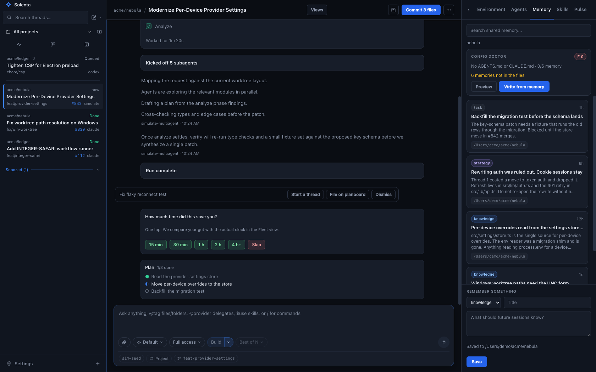
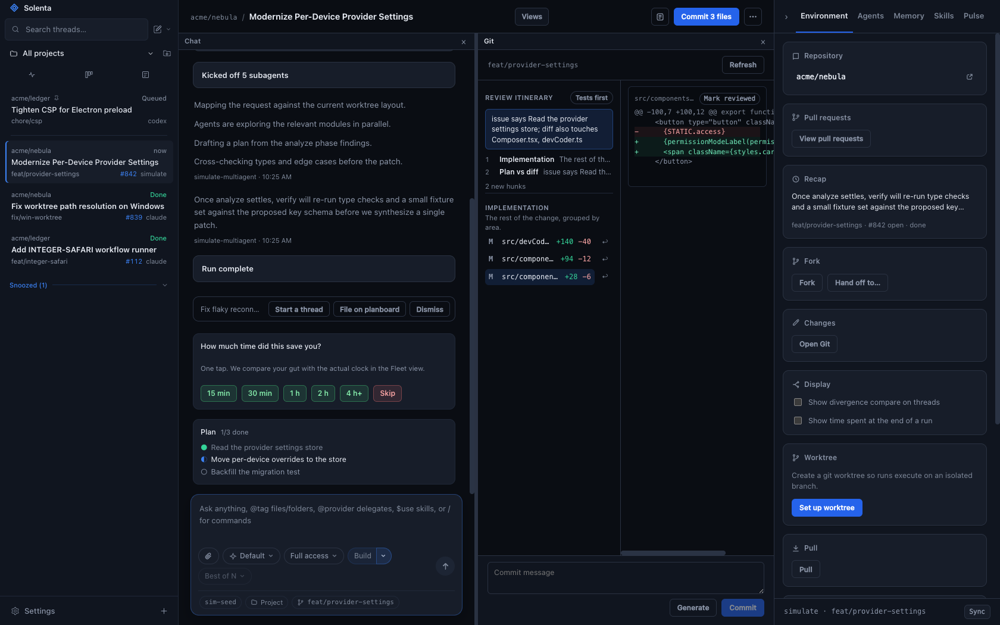

<p align="center">
  
</p>

<h1 align="center">Solenta</h1>

<p align="center">
  <strong>Every agent starts where the last one stopped.</strong><br/>
  Shared local memory across Claude Code, Codex, Cursor, Kimi, Grok, and OpenCode.<br/>
  Session ten does not re-learn what session one already ruled out.
</p>

<p align="center">
  <a href="https://github.com/currentbits/solenta/releases/latest"></a>
  <a href="LICENSE"></a>
  
  
</p>

<p align="center">
  <a href="https://solenta.app">Website</a> ·
  <a href="https://solenta.app/docs.html">Docs</a> ·
  <a href="https://github.com/currentbits/solenta/releases/latest">Download</a> ·
  <a href="https://solenta.app/changelog.html">Changelog</a> ·
  <a href="https://github.com/currentbits/solenta/issues">Issues</a>
</p>

<p align="center">
  
</p>

## The problem

New coding-agent sessions start blank. Context gets re-pasted across Claude Code,
Codex, and Grok. The tenth thread is not smarter than the first — just more
expensive.

## What Solenta remembers

A local memory server is auto-injected into every session. SQLite on disk, FTS +
vector search, HTTP + MCP, localhost-only, bearer-token gated. No per-agent
wiring.

```text
Claude Code · thread 1
  Ruled out a rewrite of auth. Cookie session stays.
  Refresh lives in src/lib/auth.ts.

Codex · thread 3
  The 401 retry is in src/lib/api.ts.
  Moving it breaks the refresh path.

Grok · thread 6
  Starts knowing both. Adds the expiry skew
  and leaves the rest alone.
```

- **Hypothesis ledger** — the next thread inherits what the last one already
  ruled out.
- **Provenance and trust score** — every entry tracks which agent wrote it and
  how reliable that agent has been.
- **File:line / thread / commit citations** — before a fact is injected, its
  file citations are checked against the current worktree; contradicted entries
  are invalidated.
- **Embeddings** — near-dup and contradiction detection so the store does not
  bloat with repeated or conflicting facts.
- **memory_distill** — collapse raw entries into strategy notes.
- **Memory tab** — reads the same SQLite file. A config doctor lints and
  regenerates CLAUDE.md / AGENTS.md from shared memory.
- **Per-repo code index** — a symbol index built once and injected into every
  dispatched prompt, so a fresh worker starts knowing where things live.

<p align="center">
  
</p>

## The rest of the desk

Memory is why Solenta exists. The rest is so you can run the agents that write
it.

- **Six providers, one UI** — Claude Code, Codex, Cursor, Kimi Code, Grok, and
  OpenCode, with model overrides, session resume, and quota-reset resume.
- **Git in the loop** — fail-closed worktrees (setup failure never falls back
  to the project checkout), Git as a center pane rather than an overlay, a
  next-action button (commit → push → PR → checks → merge), live CI badges,
  review itinerary, conflict forecast. Settings probes forge readiness
  (`gh` auth) before the header offers Create PR. Oversized PRs (default
  400 lines) are refused; the header offers a stacked split. Fork and archived
  worktrees are garbage-collected on their own; the branch always survives.
  Merge conflicts get a one-click "let the agent resolve it", and an open PR
  can be checked out into its own worktree. Jujutsu (`jj`) projects work too.
  Files are staged with a checkbox per row before commit or merge, and a click
  on a diff line number leaves an inline comment that goes back to the agent
  as a follow-up prompt.
- **Terminal and Browser panes** — a long-lived shell in the thread's worktree
  (`cd` and exports persist), and an embedded loopback-only browser on your dev
  server. Screenshot the page into the composer, or let the agent navigate,
  click, type and screenshot it through the `preview` tool.
- **Planboard** — a project's plan as its GitHub issues via `gh`, with auto-
  dispatch from `plan:todo`, a review-load meter on the open PR queue, and
  issues that close themselves when the thread's work lands.
- **Orchestration** — workers nest under the thread that started them, crews,
  `/handoff`, `/advisor`, `/committee`, a subagent model pool, and
  coder-threads host tools so an agent can archive, settle, stop, rename,
  merge, or open a PR.
- **Verify means green** — a thread settles done only when its verify command
  exits 0. After merge the command re-runs 24h later; a failure starts a
  fix thread and reopens the planboard issue. Optional spend caps.
- **Guardrails on what agents install** — skills, MCP servers and packages an
  agent tries to install are scanned locally before they land and reported as
  trusted, caution, or blocked. A diff that reaches outside the files the task
  implied is flagged as blast radius. Stored provider keys are encrypted.
- **You own it** — MIT, no Solenta account, no Solenta cloud, local SQLite,
  GitHub issues. The only network traffic is a release check.

<p align="center">
  
</p>

## Install

> [!IMPORTANT]
> Solenta drives CLIs; it doesn't ship them. Install and sign into at least one
> provider first — Solenta finds them on your `PATH`.
>
> | Provider | Install | Sign in |
> |---|---|---|
> | [Claude Code](https://claude.com/product/claude-code) | `npm i -g @anthropic-ai/claude-code` | `claude` → `/login` |
> | [Codex](https://developers.openai.com/codex/cli) | `npm i -g @openai/codex` | `codex login` |
> | [Cursor](https://cursor.com/cli) | `curl https://cursor.com/install -fsS \| bash` | `cursor-agent login` |
> | [Grok](https://x.ai/cli) | see x.ai/cli | `grok login` |
> | [OpenCode](https://opencode.ai) | `npm i -g opencode-ai` | `opencode auth login` |
> | [Kimi Code](https://github.com/MoonshotAI/kimi-cli) | `pip install kimi-cli` | `kimi` → follow prompts |

Grab an archive from the [latest release](https://github.com/currentbits/solenta/releases/latest):

- **macOS (Apple Silicon)** — `Solenta-<v>-macos-arm64.zip`. Unzip, move
  `Solenta.app` to `/Applications`, double-click. Signed with a Developer ID and
  notarized by Apple, so Gatekeeper opens it like any other app.
- **Windows (x64)** — `Solenta-<v>-win32-x64.zip`. Unzip anywhere, run
  `solenta.exe`. Unsigned, so SmartScreen asks once. There is no installer
  and no winget package; see the note in `scripts/package-cross.sh`.
- **Linux (x64)** — `Solenta-<v>-linux-x64.tar.gz`. Extract, run `./solenta`.

### Updates

Builds are stamped with a channel. **prod** follows the newest normal release;
**nightly** follows the newest prerelease and never migrates itself onto prod.
On macOS the app downloads and swaps itself in place. On Windows it
downloads beside the portable folder and swaps after you Restart (the
running exe locks those files). Linux still opens the release page. A
window that reloads into a new renderer against an old preload hard-blocks
until you Restart. Builds from a dev tree carry no stamp and never
self-update.

Nightly ships as **Solenta Nightly.app** (`com.willem.solenta.nightly`,
`solenta-nightly` on linux/win) so it is tellable apart from a prod install at
launch time. Both channels share one userData directory — the bundle is
renamed, the app name inside it is not.

### Remote access

```bash
/Applications/Solenta.app/Contents/MacOS/Solenta --serve-web        # 127.0.0.1:4620
/Applications/Solenta.app/Contents/MacOS/Solenta --serve-web=4700 --serve-host 0.0.0.0
```

The session token is printed to stdout on start (`solenta-web: token …`) and
persisted at `<userData>/web-token`. There is no TLS in v1 — binding beyond
loopback puts a token-gated API on your LAN, which is your call to make.

## How it works

Electron main owns the agents and the disk; the renderer is a React app; preload
exposes a typed `window.coder`. Providers are a data-driven registry
(`electron/providers.js`), each spawned and parsed by an adapter, and the runner
keys every event to a run id so a stopped run can never write into a newer one.

| Layer | Path |
|---|---|
| Main (window, store, runner, memory supervisor) | `electron/main.js` |
| IPC bridges | `electron/ipc.js`, `electron/preload.js` |
| Services (projects, threads, settings, spend gate) | `electron/services.js` |
| Renderer | `src/` |
| Workflow engine (pure) | `core/` |
| Memory server (MCP + HTTP) | `memory-server/` |

Full detail: [`docs/ARCHITECTURE.md`](docs/ARCHITECTURE.md).

## Development

```bash
npm install
cd core && npm install && npm run build && cd ..
npm run dev              # Vite (HMR) + Electron against the real main process
```

`npm run dev` is the loop to develop in: the window loads the Vite dev server,
so every renderer edit hot-reloads while `electron/` runs for real — real
services, real git, real providers, real store.

To check a production bundle instead: `npx vite build && CODER_PROD=1 npx electron .`

`npm run dev:browser` opens the renderer in a browser with no Electron, backed
by the fixtures in `src/devCoder.ts` (demo and trailer captures). Fixtures are
not the app: they store what you give them and return something plausible. Do
not read behaviour off them, and never fix a bug there.

```bash
npm test                 # all four suites, same as CI (.github/workflows/test.yml)

npm run test:core        # workflow engine — also builds core/dist, which electron needs
npm run test:renderer    # renderer
npm run test:electron    # electron main
npm run test:memory      # memory server (needs `npm ci --prefix memory-server`)
```

`npm run acceptance` stays manual: one real claude turn, not part of CI.

<details>
<summary>Packaging and code signing</summary>

`bash scripts/package-app.sh` builds `out/Solenta.app`; `scripts/publish-release.sh
prod|nightly` builds every platform, notarizes the mac bundle and cuts the
GitHub release. Cut both channels from one throwaway detached worktree at
`~/code/coder-release` (never the main checkout at `~/code/coder`, never the
named leftover `~/code/coder-release-build`). After publish, always
`git worktree remove ~/code/coder-release`. The header of
`scripts/publish-release.sh` is the operator checklist.

Signing happens in `scripts/codesign-app.sh` (hardened runtime, entitlements in
`scripts/entitlements.plist`) and reads credentials from the environment only:

| Var | Purpose |
|---|---|
| `CODESIGN_IDENTITY` | Full identity string. Auto-detected from the keychain when unset. |
| `APPLE_KEYCHAIN_PROFILE` | `notarytool` profile name. Preferred over the three below. |
| `APPLE_ID` / `APPLE_TEAM_ID` / `APPLE_APP_PASSWORD` | Fallback. The password is an app-specific password from appleid.apple.com, never the account password. |

Store the profile once instead of exporting a password per shell:

```bash
xcrun notarytool store-credentials solenta \
  --apple-id you@example.com --team-id TEAMID --password <app-specific-password>
export APPLE_KEYCHAIN_PROFILE=solenta
```

Local builds sign but do not notarize (a multi-minute round trip to Apple that
a bundle which never leaves this machine does not need). Only a `--tag` build —
what `publish-release.sh` produces — notarizes and staples. Without a Developer
ID cert a local build still succeeds, unsigned, with a loud warning; a release
build fails instead of quietly shipping something Gatekeeper blocks.
</details>

**Env:** `CODER_CLAUDE_BIN`, `CODER_CODEX_BIN`, `CODER_KIMI_BIN`,
`CODER_GROK_BIN`, `CODER_OPENCODE_BIN` (CLI paths) · `CODER_SIMULATE=1` (fake
provider) · `CODER_MEMORY_CONFIG` / `CODER_MEMORY_ENTRY` / `CODER_NODE_BIN`
(memory server) · `CODER_PROD=1` (load `dist/`) · `VITE_DEV_SERVER_URL`
(default `http://localhost:5173`).

<details>
<summary>Electron binary fails to install</summary>

npm allow-scripts can skip Electron's postinstall, leaving a stub `dist` with no
`path.txt` ("Electron failed to install correctly"). Repair from the cache —
match the version to `node_modules/electron/package.json`:

```bash
ditto -x -k ~/Library/Caches/electron/*/electron-v*-darwin-arm64.zip \
  node_modules/electron/dist
printf 'Electron.app/Contents/MacOS/Electron' > node_modules/electron/path.txt
```

The root `package.json` already allows scripts for the pinned Electron version.
</details>

## Also in the box

- **First run** — a setup wizard checks which agent CLIs are on your `PATH`
  (with per-provider install hints), adds the first project, and sets the
  defaults, then a short tour of the panes. Skippable, shown once.
- **Teach mode** — hints, not solutions, across every provider. Autonomy
  steps from Hints to Review to Pair as reviews pass.
- **Ask mode** — read-only Q&A from the code map and memory. No tools, no
  worktree, no agent credits.
- **`/btw`** — a side question on the same thread that does not pause, steer,
  or queue behind the live run.
- **`/feedback`** — send a note straight to the Solenta team from the composer.
  The text goes to us, never to the model, and never occupies the live turn.
- **Sidebar** — T3-flat: no project group headers. A row is status + title +
  age; pinned threads sit in a block at the top; snoozed and settled
  (archived at the tail) live in shelves. Scope to one project from the
  header. Right-click opens a native thread-actions menu. Project icons
  auto-detect from the repo (favicon / app icon). Subagents nest under
  their thread.
- **Snooze** until tonight or next week; settle-on-merge when the PR lands.
- **Suggested work** — out-of-scope findings become one-click chips that
  start a new thread or file a planboard issue.
- **Automations** — recurring prompts (hourly / daily / weekly) against any
  project, and repeat a finished thread on a schedule.
- **Usage and fleet analytics** — cost and tokens per provider/model, merge
  rate, review tax, rework and cost per merged PR, and felt vs wall-clock
  speedup. OTel GenAI spans ship to your tracing backend.
- **Morning digest** — one summary of everything that ran unattended.
- **Agent profiles** — save a provider + model + effort + permission combination
  and apply it in one click.
- **Spec mode** — gated requirements → design → tasks artifacts, each approved
  before the next unlocks. tasks.md becomes a dispatch DAG (`needs:`);
  converge appends missing work back onto the file.
- **Divergence** — compare two runs at the first mismatched tool step.
  Toggled from Environment (default off), alongside the time-spent segment
  in the message footer at the end of a run (also default off).
- **Claim provenance** — assistant claims tagged repo, memory, issue, or
  model prior knowledge when ungrounded.
- **Skills and `/` commands** — browse and edit the `SKILL.md` files your
  agents can reach. The composer `/` palette also runs the underlying CLI's
  own skills and custom commands.
- **Permission card** — edit the proposed shell command before you approve
  it; the agent runs the edit, not the original.
- **Dev servers** — start a project's `dev` script from the app and get the URL.
- **Web mode** — `--serve-web` serves the same UI over HTTP + WebSocket.
- **SSH remote projects** — register projects on other hosts and run agents
  against them.
- **Windows** — WSL-boundary detection, project-add doctor, sandbox badge.
- **Worktree GC** — per-project retention, batch cleanup, visible disk usage.
- **Vibe Kanban import** — read the local VK data folder, turn cards into
  threads, export a JSON dump of your projects and threads.

## Status

Early and moving fast. Expect bugs and rough edges — [issues][issues] are
welcome, and small PRs more so than large ones.

- [`docs/ARCHITECTURE.md`](docs/ARCHITECTURE.md) — process split, providers, runner, memory, store
- [`docs/ISSUES.md`](docs/ISSUES.md) — symptom / cause / fix log

## Acknowledgments

Solenta's design and some of its feature ideas are inspired by
[t3code](https://github.com/pingdotgg/t3code) and
[Synara](https://github.com/Emanuele-web04/synara). No code from either project
is used; everything here is original work under the [MIT license](LICENSE).

[issues]: https://github.com/currentbits/solenta/issues
