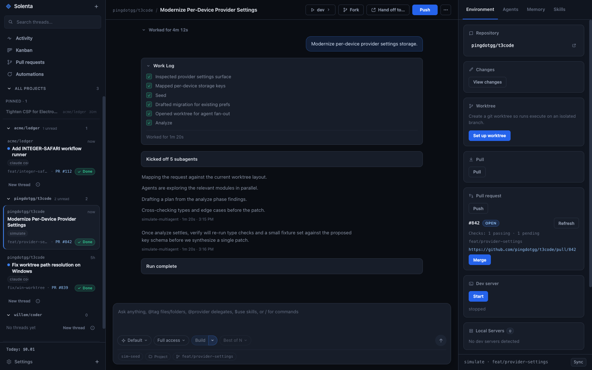

<p align="center">
  
</p>

<h1 align="center">Solenta</h1>

<p align="center">
  <strong>A local-first desktop control surface for coding agents.</strong><br/>
  Run Claude Code, Codex, Kimi, Grok, and OpenCode side by side — with worktrees,
  PRs, spend guardrails, and shared agent memory, all in one window.
</p>

<p align="center">
  <a href="https://solenta.app">Website</a> ·
  <a href="https://solenta.app/docs.html">Docs</a> ·
  <a href="https://github.com/currentbits/solenta/releases/latest">Download for macOS</a> ·
  <a href="https://github.com/currentbits/solenta/issues">Issues</a> ·
  <a href="LICENSE">MIT License</a>
</p>

---

<p align="center">
  
</p>

## What it is

Solenta turns "kick off an agent in a terminal and hope" into a directed,
visible workflow. Each **thread** is a provider session against one of your
projects: you watch the conversation and work log live, inspect the diff, and
land the result as a PR — without juggling terminal tabs, branches, or PIDs.

Everything runs locally. Solenta shells out to the agent CLIs you already have
installed and keeps its state on your disk.

## Features

- **Five providers, one UI** — Claude Code, Codex, Kimi, Grok, and OpenCode
  threads with sticky permission modes, per-thread model overrides, and session
  resume where the provider supports it.
- **Three-pane workspace** — projects and threads on the left, conversation +
  work log in the center, and a live agent/git/memory panel on the right.
- **Isolated git worktrees per thread** — set up, diff, merge to main, push, or
  delete from the Git tab. Open a PR straight from a thread and watch its CI
  checks as badges.
- **Build workflows** — multi-phase pipeline templates (plan, analyze, verify…)
  with per-phase providers, fan-out, and a judge step; watch each phase settle
  in the Agents panel.
- **Shared agent memory** — a supervised local memory server (MCP + HTTP) is
  auto-injected into agent sessions, so what one thread learns, the next one
  knows.
- **Spend guardrails** — optional daily budget caps block new runs when the
  day's spend hits the limit; token usage is visible per thread.
- **Automations** — schedule recurring prompts (hourly / daily / weekly) against
  any project.
- **Web mode** — `--serve-web` exposes the same UI over HTTP + WebSocket behind
  a session token, so you can check in from a browser.
- **SSH remote projects** — register projects on remote hosts and run agents
  against them over SSH.
- **Activity feed** — one chronological view of everything your agents did.

## Install

Grab an archive from the
[latest release](https://github.com/currentbits/solenta/releases/latest):

- **macOS (Apple Silicon):** `Solenta-<v>-macos-arm64.zip` — unzip, move
  `Solenta.app` to `/Applications`. Not notarized: right-click → **Open** the
  first time (or `xattr -dr com.apple.quarantine /Applications/Solenta.app`).
- **Windows (x64):** `Solenta-<v>-win32-x64.zip` — unzip anywhere, run
  `solenta.exe`. Unsigned, so SmartScreen will ask once.
- **Linux (x64):** `Solenta-<v>-linux-x64.tar.gz` — extract, run `./solenta`.

Then install whichever agent CLIs you want to drive (`claude`, `codex`,
`kimi`, `grok`, `opencode`) — Solenta finds them on your `PATH`.

## Dev

```bash
npm install
cd core && npm install && npm run build && cd ..
npx vite build
CODER_PROD=1 npx electron .
```

Vite-only mock (no Electron): `npx vite` (`src/devCoder.ts` implements
`window.coder`).

### Tests

```bash
npm test              # all four suites, same as CI (.github/workflows/test.yml)

npm run test:core     # core engine — also builds core/dist, which the electron suite needs
npm run test:renderer # renderer / devCoder
npm run test:electron # electron main
npm run test:memory   # memory server (needs `npm ci --prefix memory-server`)
```

`npm run acceptance` stays manual: one real claude turn, not part of CI.

### Env

`CODER_CLAUDE_BIN`, `CODER_CODEX_BIN`, `CODER_KIMI_BIN`, `CODER_GROK_BIN`,
`CODER_OPENCODE_BIN` (CLI paths); `CODER_SIMULATE=1` (simulate provider);
`CODER_MEMORY_CONFIG` / `CODER_MEMORY_ENTRY` / `CODER_NODE_BIN` (memory server);
`CODER_PROD=1` (load `dist/`); `VITE_DEV_SERVER_URL` (default
`http://localhost:5173`).

### Electron binary on this machine

npm allow-scripts can skip Electron postinstall (stub dist, missing `path.txt`,
"Electron failed to install correctly"). Repair from the cached zip:

```bash
# match version to node_modules/electron/package.json
ditto -x -k ~/Library/Caches/electron/*/electron-v*-darwin-arm64.zip \
  node_modules/electron/dist
printf 'Electron.app/Contents/MacOS/Electron' > node_modules/electron/path.txt
```

Root `package.json` already has `"allowScripts"` for the pinned Electron version.

## Docs

- `docs/ARCHITECTURE.md`: process split, providers, runner, memory, store
- `docs/ISSUES.md`: short symptom/cause/fix log
- `PRODUCT-SPEC.md`, `BRAINSTORM.md`: historical (not kept current)

## Acknowledgments

Solenta's design and some of its feature ideas are inspired by
[t3code](https://github.com/pingdotgg/t3code) and Synara. No code from
either project is used; all code here is MIT-licensed original work.
