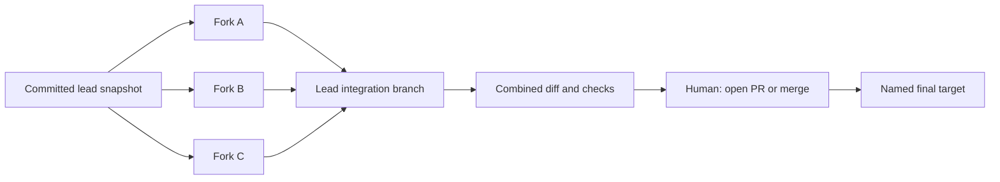

# Orchestrated worktree merge workflow audit

2026-09-06, source at `6c7a6fbebb066942f7f5702084f1af1e0730319d`.

## Recommendation

Use one isolated lead branch as the integration destination for a crew, then review one combined result before final landing. Put the controls and state on the lead, beside the existing team/task information.



This is a proposed flow, not the current implementation. A later dependent fork should start from the newer integrated lead snapshot. Already-running forks stay on their original snapshots until explicitly updated.

The integration view should answer:
1. Which workers finished, and which have actually been reviewed?
2. What is each worker based on, and where will its changes go?
3. What has already been integrated, what conflicts, and what is blocked?
4. Were checks run on this exact combined commit?
5. What is the final target, and what will the final action do?

Keep these states distinct: Running, Ready for review, Conflicted, Integrated, Landed. “Done” from a model is not proof of integration or verification.

## What happens today

- `forkWorkerThread` creates a new thread and flags a lazy worktree. It records handoff identity, but not the lead's source commit.
- Worktree setup starts from that worker's baseBranch or the repo default. A committed change present only on the lead is absent from a fresh worker.
- `thread_merge` squashes a worker into the lead worktree if the lead has one. Without it, the worker's recorded base/default merge path is used.
- A worker's own Git-tab Merge goes through IPC without `intoPath`, so it does not necessarily have the same target as the orchestrator's merge.
- The lead's team roster is useful for run status and navigation, but does not show an integration order or durable landing receipt.
- A successful worker merge calls issue completion and removes its branch/worktree, even when the change is only on a lead branch.

These are disconnected pieces of an integration workflow. Requiring the user to reconcile them through chat is what the proposed lead view addresses.

## Verified findings

An isolated real-Git reproduction creates a lead and two workers:
- Lead commits a unique file. A newly forked worker starts on main and cannot see it.
- Worker A integrates into the lead. Main HEAD stays unchanged, yet the issue-completion function is called. The script stubs the GitHub write so no real issue is changed.
- A's branch/worktree are removed and its thread fields cleared.
- Worker B edits the same line and conflicts. The lead HEAD stays intact and conflict entries are left in B for resolution.

The last behavior is correct. An initial suspicion that conflict replay used main was rejected: the historically named `defaultBranch()` resolves the branch currently checked out at the explicit target, whereas `repoDefaultBranch()` is the distinct default-branch helper. No conflict-target bug was filed.

Run:
```sh
node docs/issue-drafts/2026-09-06-merge-evidence.mjs
```
Exit 0. Temporary repository only, no live agents/refs/remotes modified. This audit does not claim to have exercised the native desktop visually.

## Three approaches considered

| Approach | Benefit | Cost |
| --- | --- | --- |
| Lead integration branch, one final result | One place to inspect order, conflicts and combined checks; keeps partial work off the final target. Recommended for one task split among forks. | Needs explicit integration state and source snapshots. |
| Separate PR per worker | Good for independently shippable tasks with separate reviewers. | More PR/dependency coordination; does not itself prove the combined task. Keep as an explicit option. |
| Merge every worker directly to the final branch | Fewest apparent steps. | Partial results land before combined review, and per-worker checks do not validate the combined task. Avoid as the crew default. |

## Smallest delivery sequence

1. Correct premature issue completion. Integration should produce a durable receipt and leave issues open until the final result lands.
2. Record committed source snapshots for orchestration forks. Do not silently copy dirty lead edits or use one field for both start ref and landing target.
3. Add the lead Integration view, using the existing roster, task dependencies, diff, checks and conflict-resolution actions.
4. Use existing #346 for serialized queue execution and a combined-check gate. The new view is not another queue implementation.

Show the batch before it starts. A direct “Prepare selected” action can authorize those named integrations; it must not imply permission to merge to main. The final PR/merge action stays explicit. Checks attach to an exact candidate commit and go stale when the candidate changes.

When B conflicts after A integrated: preserve A's receipt, show B as conflicted, keep dependent C blocked, offer Resolve in B, then refresh/recheck before continuing. Do not automatically undo all successful workers. If the user excludes a worker already integrated, rebuilding a clean candidate from the recorded base is safer than guessing at squash ancestry, but that can be a later capability rather than part of the first view.

Keep lightweight receipts after worktree cleanup rather than retaining every worker's dependency directory. A receipt needs enough identity to say which worker/source commit was integrated into which lead commit and which issues await final landing.

## Backlog deduplication

- #346: existing local serialized merge queue; reuse, do not duplicate.
- #600/#614: worker merge primitive and human control; preserve.
- #163/#90: conflict replay and agent resolution already exist and are useful.
- #249: conflict forecast; use existing signal rather than add a new predictor.
- #187/#775: stacked bases and retargeting; source snapshots are a different responsibility.
- #632: issue closure; the staging/final distinction is a concrete follow-up.
- #420: delayed post-merge verification; not a substitute for checking the combined candidate before final landing.
- #646: renderer build coverage; do not invent another build framework.

## Publication

Published through the existing Grok host publisher; independently fetched and verified all three as OPEN with plan:todo:

- [#947 Do not close worker issues at intermediate integration](https://github.com/currentbits/solenta/issues/947)
- [#948 Record a committed lead snapshot for each worker](https://github.com/currentbits/solenta/issues/948)
- [#949 Lead Integration view with explicit targets/readiness](https://github.com/currentbits/solenta/issues/949)

Use existing [#346](https://github.com/currentbits/solenta/issues/346) for queue execution. Payloads: `2026-09-06-merge-audit.json`; the publisher records its receipt in `2026-09-06-merge-publication.json`. No app implementation or actual project merge is part of this research task.
