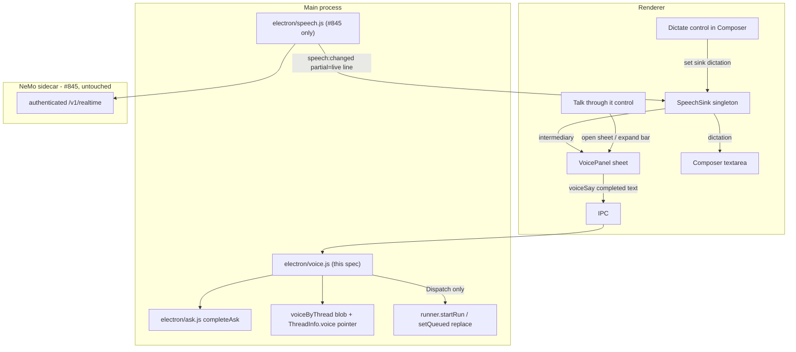
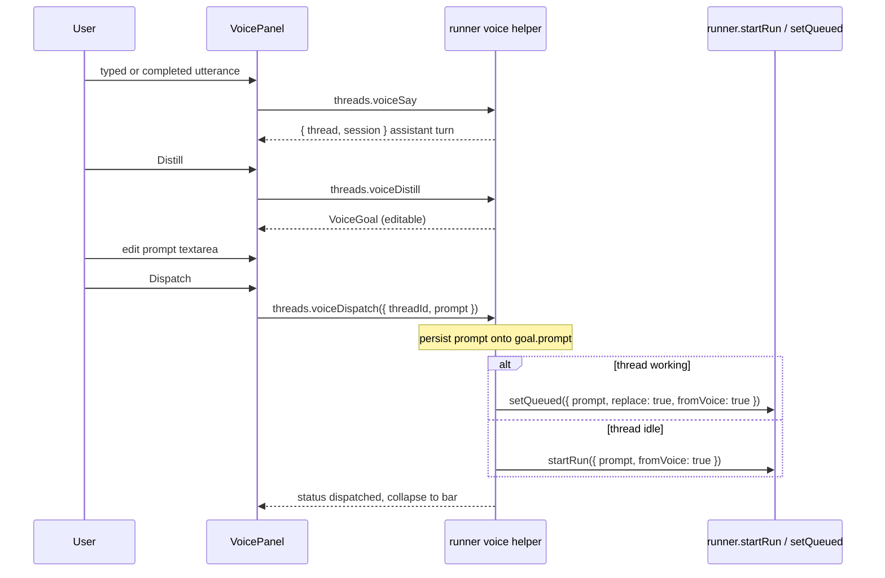
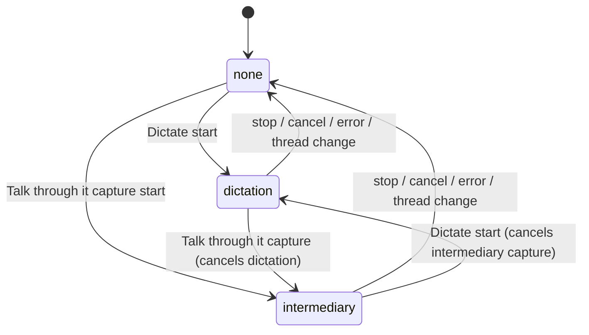

# Voice intermediary (rubber-duck) design

Issue #168. **Status:** Draft. **Date:** 2026-09-03. **Author:** (spec)
**Revised:** 2026-09-03 (review rounds 1-3; user decisions; #845 erratum marked applied, issue #856)

**Decided 2026-09-03:** 30s turns / 90s Distill; Dispatch disabled until Distill; ⌘⇧Space opens Talk through it; helper does not see the composer draft.

Depends on issue #845 for the microphone path only. Live composer dictation is **not** this feature; it is specified in `docs/superpowers/specs/2026-09-03-live-speech-to-text-design.md` and must not be reimplemented here. This spec's #845 erratum is **applied** in that live STT spec (issue #855): SpeechSink owns capture; Composer is the dictation consumer.

Product PRs for #168 stay blocked on an explicit user ask to implement. Open Questions are resolved (see Decisions from review). This document is the deliverable.

## Overview

Solenta users currently have two expensive ways to think out loud at an agent: type a rambling prompt into `Composer` and burn a coding-agent turn, or wait for live dictation (#845) to dump that ramble into the same textarea. Neither is a brainstorming surface.

This spec adds a **voice intermediary**: a cheap, no-tools helper with its own persisted session on the current thread. The user rubber-ducks in a sheet above the composer (typed in v1, microphone later). The helper distills the conversation into an editable structured goal. **Dispatch** is the only action that calls `runs.start` / `startRun`, and it burns exactly one coding-agent turn (or **replaces** the follow-up queue via `setQueued({ replace: true })` if the thread is already working).

Turns live in a per-thread blob (`voiceByThread`), not on the sidebar `ThreadInfo` row. The list row holds only a tiny pointer.

The intermediary sits **on top of** #845's capture and `speech` IPC once they exist. It does not live in the NeMo sidecar, does not own `electron/speech.js`, and does not write the composer draft.

## Background & Motivation

### What #168 originally asked for

The issue title is "Voice dictation in the composer". The original body compared CodexMonitor Whisper dictation and Synara mic mode, and noted Solenta had no audio capture. That implementation is now #845 (NeMo-Speech.cpp, Nemotron streaming Q8, partials in the draft). macOS Speech.framework is **not** revived.

### What this issue is now

Willem's research comment is the product:

> put a voice intermediary agent between the mic and the coding agent — a cheap fast model with its own context that you rubber-duck with conversationally, which distills the rambling into a structured prompt/goal before dispatch. Voice brainstorming without burning a coding-agent turn.

Follow-ups: leave #168 open for the intermediary; live-transcription will not absorb this design. #845 PRs are still blocked on Win/Linux CI (draft PR https://github.com/currentbits/solenta/pull/850). First #168 PRs are typed-only so they do not wait on that landing.

### Pain points in the current product

- `Composer` (`src/components/Composer.tsx`) is already dense: slash commands, `/btw`, vim, paste cards, model picker, stash, Best of N, attach. Dumping a rubber-duck conversation into the textarea would collide with all of that and with #845's provisional draft range.
- `runs.start` / `runner.startRun` is how a coding-agent turn is burned: it takes `active`, appends transcript messages, materializes worktrees, and spends the daily budget. Ask mode (`electron/ask.js` `completeAsk`) and `/btw` (`electron/btw.js` + `runner.startBtw`) already prove a cheap helper path that does none of those things.
- There is no TTS in the product (ElevenLabs exists only in `teaser-ade`). v1 is voice-in / text-out.
- Large per-thread data does not belong on `ThreadInfo`. Transcripts live in `messagesByThread` and ride `threads.get` / tailed `thread:updated`. `thread.plan` is truncated to `PLAN_STORE = 4000` because "this one rides every threads:changed push, for every thread" (`electron/runner.js` 166-169; `src/shared/ipc.ts` JSDoc on `plan`). A 40-turn helper transcript on the list row would inflate `pushThreadsChanged` (`listThreads` at `electron/runner.js` ~2399), every stream `pushDetail` (`~2026-2053`), `src/bootSnapshot.ts` (`MAX_SNAPSHOT_CHARS = 4_000_000`), and `src/threadPatch.ts` `sameJson` (comment: "the payloads are small").

## Goals & Non-Goals

### Goals

- A per-thread **session** (not a new thread type) for conversational rubber-ducking with a cheap model.
- Typed path first, fully usable without #845. Typed path does **not** filter language.
- After #845's `speech` IPC exists, route completed utterances into that session via a renderer-only `SpeechSink`. Dictation XOR intermediary XOR none.
- Explicit Distill, then explicit Dispatch of one coding-agent turn on the **current** thread. The panel sends the current prompt textarea on Dispatch.
- Reuse `completeAsk` (fm then print-mode) with a **voice-owned packer** (digest, memory, code index). No tools. No `active`. No daily budget until Dispatch.
- Distinct UI from #845's composer dictation mic.

### Non-goals (v1)

- TTS / spoken replies
- Wake word
- Voice commands that skip the cheap model and go straight to the coding agent
- Languages other than English **on SpeechSink / #845**. Typed rubber-duck does not filter language.
- Cloud STT
- Putting rambling into the coding-agent CLI session
- Auto-dispatch without a click
- Modifying the NeMo sidecar, websocket protocol, model download, or `electron/speech.js` (suffix assembly of streaming frames, if any, belongs in #845)
- Windows/Linux STT feasibility (that is #845)
- A new thread kind (ask / teach / spec / orchestrator / memory-consolidate stay as they are)
- Streaming helper tokens (btw/ask are one-shot print-mode; this is the same)
- Rewriting the thread's provider/model when the panel opens
- Absorbing #845 dictation, or putting this feature inside the live-STT sidecar
- OTel metrics SDK / `solenta.voice.*` counters (traces-only today; v1 is log lines)

## Key Decisions

1. **Session, not a thread type; turns are not on `ThreadInfo`.** `store.data.voiceByThread[threadId]` holds the conversation (same idea as `messagesByThread` / `workLogByThread`). `ThreadInfo.voice` is only `{ id, status, turnCount, panelOpen }` for chrome. Opening the panel does not change the coding agent, CLI session, permission mode, or worktree. Forks do not copy the blob or the pointer (`forkThread` copies `ask` / `teach` only; it does not copy `btw`).

2. **Cheap helper is the `completeAsk` family, never `startRun`, until Dispatch.** Each completed utterance (or typed line) is a no-tools completion. Same budget exemption as `/btw`. One in-flight voice helper per thread (`voiceActive`). Does not occupy `runner` `active`. Independent of `btwActive` (a thread may run 1 voice helper + up to 3 btw cards).

3. **Model selection is a settings profile, not the thread picker.** `settings.voiceIntermediaryProfileId: string | null` points at an `AgentProfile`. Empty uses today's `completeAsk` fallback (fm, then the **thread's** provider in print-mode, then retrieval). A set profile uses that profile's provider+model in print-mode only (`skipFm`); missing CLI is a turn error, not retrieval and not a silent rewrite of `thread.provider`. This is not `subagentPool.defaultAlias` and not `defaultOrchestratorProfileId`. Deleting a profile must explicitly `matchingProfileId` this field; it does not piggyback on the orchestrator assignment.

4. **Speech routing is renderer-only.** One app-wide transcription session remains #845's. A module-singleton `SpeechSink` (`dictation` | `intermediary` | `none`) decides who consumes `speech:changed`. Sidecar protocol, NeMo websocket handling, and `electron/speech.js` stay #845's. This spec's #845 erratum is **applied** in the live STT spec (issue #855): SpeechSink owns capture; Composer is the dictation consumer. SpeechSink product code lands in the **#845 renderer PR**; #168 only adds the intermediary consumer.

5. **Feed the cheap model completed utterances, not live partials.** `speech:changed` `partial` is the current live line: **replace**, do not concatenate, matching how Composer will treat the provisional range. Final / completed text commits. Suffix assembly of websocket frames, if needed, belongs inside `electron/speech.js` (#845), not here. `threads.voiceSay` is called only with a completed utterance. A live partial line in the panel is OK and is not persisted.

6. **UI is a sheet above the composer, not the textarea.** Distinct control labeled **Talk through it**. #845's control is labeled **Dictate**. Mutually exclusive sinks. Composer textarea stays editable during intermediary capture (the opposite of #845 dictation, which makes it read-only).

7. **Distill is a click; Dispatch is a click. Decided 2026-09-03.** The helper may *say* the goal looks ready. The UI never auto-distills or auto-dispatches. Dispatch is disabled until Distill has produced a goal (or a previous goal is still held after Keep talking: **Dispatch previous goal**). `voiceDispatch({ threadId, prompt })` takes the **current panel textarea**; main persists that string then `startRun` / `setQueued`.

8. **Busy thread: replace the follow-up queue, do not concatenate.** `threads.voiceDispatch` calls **internal** `services.setQueued({ threadId, prompt, replace: true, fromVoice: true })` (not `CoderApi.threads.setQueued`, which must not grow `fromVoice`) when `thread.status === "working"` or `active.has(threadId)`, otherwise `runner.startRun({ ..., fromVoice: true })`. Banner: `Dispatch will replace the queued follow-up.` Orchestrator `pendingFork` is left to existing `startRun`; this feature must not invent a second fork.

9. **After Dispatch, keep a collapsed bar.** Expand shows the history read-only. **Talk through it again** starts a new id and replaces the blob. The Composer Talk through it button on a `dispatched` session **expands** the bar; it does not replace. `listening` is SpeechSink-only, never a persisted status.

10. **Typed PR does not wait on #845.** First implementation is types + store + helper + panel + dispatch. Mic wiring is a later PR that only adds the intermediary `SpeechSink` consumer.

11. **Name collision: `runs.distill` is unrelated.** Issue #285 workflow distillation (`electron/distill.js`, `runs.distill`) keeps that name. This feature's IPC is `threads.voiceDistill`.

12. **`fromVoice` is a user turn that skips leading-slash intercepts only.** It is not `fromNotice`. It still spends budget, clears `pendingQuestion` / `pendingPlan`, hits Ask-mode and `pendingFork`, and resets `autoTurns`. `/feedback` is not a `startRun` intercept (it lives in `src/useCoder.ts`). Persist `fromVoice` on the queued blob so `drainQueued` cannot turn a distilled `/btw` goal into a side-question card.

13. **Timeouts are decided (2026-09-03), not a fork.** Conversational turn `30_000` ms; Distill `ASK_TIMEOUT_MS` (`90_000`). `timeoutMs` applies to both `fmRun` and `runPrint`.

14. **⌘⇧Space opens Talk through it. Decided 2026-09-03** (overrides the earlier "none in v1" recommendation). Display in KeyboardSheet as `⌘ + ⇧ + Space` (same style as `APP_SHORTCUTS` `⌘ + ⇧ + N` in `src/components/KeyboardSheet.tsx`). Bind app-wide when a non-archived, non-memory-consolidate thread is selected, **even when the Composer textarea is focused** (mic-in-hand). Do not fire when Settings / Workflows / KeyboardSheet / another `[role="dialog"]` is open. Do not steal Cmd-Enter, Option-Enter, Cmd-S, or Escape. Not used in the repo today. macOS Emoji is Ctrl-Cmd-Space, a different chord. If the OS/IME swallows it, the button and `/voice` remain. PR 3 is required.

15. **Helper pack does not include the composer draft. Decided 2026-09-03.** The sheet is a separate input. `buildVoicePack` has no `[Composer draft]` extra.

## Proposed Design

### Placement in the existing architecture



The cheap model never sees PCM, never talks to the sidecar, and never holds the coding-agent CLI session.

### Session, not a thread type

**Blob.** `store.data.voiceByThread` is a map of `threadId -> VoiceSession`. Load/save wiring is spelled under Data Model (EMPTY **after** `workLogByThread`, never between `messagesByThread` and `workLogByThread`; `_readFile` assignment; `AFTER_MESSAGE_KEYS`). Accessors `store.getVoice` / `store.setVoice` match `getWorkLog` / `setWorkLog`. Delete the key when `voiceClear` or `restart` replaces. Thread delete is the existing `*ByThread` cascade in `removeThread` (~3209-3215). Not sharded like messages: the session is capped and is not a coding-agent stream. `panelOpen` is **not** on the blob; it lives only on `ThreadInfo.voice`.

**Pointer on the list row.**

```ts
voice?: {
  id: string;
  status: VoiceSessionStatus;
  turnCount: number;
  panelOpen: boolean;
} | null;
```

Omitted when absent so old fixtures still deepEqual. `turnCount` is `turns.length`. This pointer is what `listThreads` / `pushThreadsChanged` / boot snapshot / `sameJson` see. Worst case a few dozen bytes, not 800 KiB.

**Delivery of turns.** Full `VoiceSession` is **not** on `ThreadInfo` and **not** on stream `pushDetail` / `thread:updated` (those ticks already tail `messages` because even capped transcripts are large). Turns ride:

- `threads.voiceGet({ threadId })` → `VoiceSession | null`
- every `threads.voice*` mutating method → `{ thread: ThreadInfo, session: VoiceSession | null }`
- `threads.get` may omit the blob; VoicePanel calls `voiceGet` when the pointer is present

After a helper reply, main writes the blob, then patches the pointer: copy `id` / `status` / `turnCount` from the blob and **keep** the existing `panelOpen` (do not derive it from the blob). Then:

- `updateThread` **without** `touch` (no `updatedAt` bump; same as `addBtw` / `finishBtw`)
- `pushDetail(threadId, undefined, { skipStamp: true })` so an active coding run is not stamped (`skipStamp` exists only on `pushDetail`, `electron/runner.js` ~1996-1999)
- `pushThreadsChanged()` (no options; sends `listThreads`)

VoicePanel: on mount / thread change, `voiceGet` if `thread.voice` is set; after each `voice*` call, use the returned `session`; on `thread:updated`, refetch `voiceGet` only when the pointer `id` / `status` / `turnCount` changed and the panel did not just issue the write.

Opening the panel:

- Does not call `threads.setProvider`, `applyAgentProfile`, `startAsk`, `startTeach`, or `startSpec`
- Does not create a worktree or touch `sessionId`
- Does not bump `thread.updatedAt`

One blob per thread. A second `voiceOpen` without `restart` returns the existing session (any status, including `dispatched`). `restart: true` mints a new id and replaces the blob (Talk through it again). Reject `restart` while `thinking` / `distilling` (Cancel first).

Fork (`services.forkThread`): do **not** copy `voice` or `voiceByThread[sourceId]`. Ask/teach copy because they are the thread's persona; this is scratch on the source thread. Same as not copying `btw`.

### Caps

Named constants in `electron/voice.js`, mirrored on `src/shared/ipc.ts` as needed:

| Constant | Value | Role |
|---|---|---|
| `VOICE_UTTERANCE_MAX` | `BTW_QUESTION_MAX` (4000) | User turn text |
| `VOICE_REPLY_MAX` | `BTW_ANSWER_MAX` (16 KiB) | Helper turn text |
| `VOICE_TURNS_MAX` | 40 | Reject new `voiceSay`; do not drop oldest |
| `VOICE_GOAL_MAX` | `BTW_ANSWER_MAX` (16 KiB) | Distilled `prompt` |
| `VOICE_PROMPT_LIMIT` | `ASK_PROMPT_LIMIT` (80_000) | Packer budget |
| In-flight helpers | 1 per thread | `voiceActive`; not shared with `btwActive` |

### Cheap model path

Each user utterance is a helper completion via `completeAsk`.

Pack, built in `electron/voice.js` **`buildVoicePack`**. This is **not** `ask.buildAskPrompt`. `buildAskPrompt` concatenates Ask-mode system + question + extras, then **slices from the start** (`electron/ask.js` ~227-252), which would keep oldest extras and drop the latest utterance. The rubber-duck system note is also not the Ask-mode "You are answering a question about this repository" note.

`buildVoicePack({ kind: "turn" | "distill", utterance, turns, digestNote, memoryNote, matchNote, indexNote })` shares the overflow loop (drop oldest remaining turns, then shrink digest, then drop index / match / memory) but **pins differently by kind**.

**`kind: "turn"`** (a `voiceSay` helper call):

1. Pin the turn system note (below) and the latest utterance. Never drop these.
2. Append prior voice turns, **newest first** (exclude the latest utterance, already pinned).
3. Append digest, then memory, then match, then index.
4. Overflow: drop the oldest remaining prior turn, then shrink digest, then extras.
5. If still over (pathological pinned pair), truncate the utterance to `VOICE_UTTERANCE_MAX`. Do not slice the system note.

Unit test: a turn pack over 80k with 40 large prior turns loses turn 1 and keeps the latest utterance + turn system note.

**`kind: "distill"`** (a `voiceDistill` helper call):

1. Pin the distill system note (below) plus the fixed one-liner `Distill the session into the JSON object.` Never drop these. There is **no** pinned user utterance.
2. Treat **all** `turns` as droppable prior context (oldest first). Do not pin a single user line: Distill needs the brainstorm, and pinning only the last say would drop the rest under overflow.
3. Append digest / memory / match / index after the turns.
4. Overflow: drop the oldest turn, then shrink digest, then extras. The pinned pair stays the distill note + one-liner.

Unit test: a distill pack over 80k drops turn 1 before later turns; the distill system note and the one-liner remain.

Context extras (same sources as `startBtw`, `electron/runner.js` ~6875-6928):

- `ask.formatThreadDigest(store.getMessages(threadId))` (12 messages, 1200 chars each)
- memory hits (`ask.formatMemoryHits`) plus `ask.prefetchBootstrapNote` on the first helper call of a session
- code-index note and `ask.formatMatchingFiles`

**Turn system note** (verbatim):

```
You are a rubber-duck for a coding task. The user is thinking out loud.

You have no tools. Do not edit files, run commands, spawn a worktree, or start other agents. Do not claim you started a run.

Ask short clarifying questions. When the goal is crisp, say so and invite Distill. Do not write large code dumps. Answer from the voice session, the thread digest, memory, and the repo map below.

This conversation does not burn a coding-agent turn.
```

**Distill system note:** see Distill + Dispatch.

Timeouts (decided 2026-09-03):

- Conversational turn: 30_000 ms
- Distill: `ASK_TIMEOUT_MS` (90_000)

`timeoutMs` applies to **both** `fmRun` and `runPrint`.

In-flight: `runner` holds `voiceActive: Map<threadId, { handle, stopping, kind: "turn" | "distill" }>`. A second `voiceSay` / `voiceDistill` while thinking is rejected: `Already answering. Wait or Cancel.` The panel input disables until the reply lands.

`btwActive` is a separate map. One voice helper + up to `BTW_RUNNING_MAX` (3) side questions on the same thread is allowed.

Heal on store **load** only (crash): blob `thinking` / `distilling` become `error` with `"Interrupted"`, same as `normalizeBtwCards` converting `running` → `error` from `migrateThread` on load (`electron/store.js` ~1180-1185), not on every `getBtw`. This conversion runs in the `_readFile` pass and **writes** the healed blob. Live `getVoice` must **not** apply it (`getWorkLog` returns stored as-is, ~2406-2408). Pointer status follows the healed blob on load. `dispatched` and `distilled` stay. Absent / junk blob → omit key and omit pointer.

Does **not**: take `active`, change `thread.status`, append `messages`, call `otel.startRun`, increment spend, materialize a worktree, or inject MCP.

### `completeAsk` contract

Today (`electron/ask.js` ~470-507): always runs `fmRun` with hardcoded `ASK_TIMEOUT_MS`; swallows print failures (`catch { return null }`); timeout, missing binary, and empty stdout are indistinguishable. Ask/btw treat `null` as retrieval (`startBtw` ~6948-6955).

Extend `completeAsk`:

```ts
type CompleteAskOk = { text: string; source: "fm" | "print" };
type CompleteAskErr = { error: "timeout" | "no-cli" | "empty" };

async function completeAsk(opts: {
  prompt: string;
  provider?: string;
  model?: string | null;
  env?: NodeJS.ProcessEnv;
  timeoutMs?: number;      // default ASK_TIMEOUT_MS; passed to fmRun AND runPrint
  skipFm?: boolean;        // default false; skip the fm block entirely
  fmRun?: ...;
  runPrint?: ...;
  onHandle?: ...;
}): Promise<CompleteAskOk | CompleteAskErr | null>;
```

- `null` only when `prompt` is empty (today's early return). Default ask/btw callers still treat "no usable text" as retrieval: `if (result && result.text)`. An `CompleteAskErr` is truthy but has no `text`, so btw UX is unchanged.
- `timeoutMs` default `ASK_TIMEOUT_MS`. `fmRun(..., { timeoutMs })` and `runPrint(..., { timeoutMs })`. `runAskPrint` already accepts `timeoutMs`; thread it through. Timeout rejects with `Error("Ask timed out")` → `{ error: "timeout" }` (do not swallow).
- `skipFm: true` skips the fm block.
- No provider / `buildAskArgs` null / `!isBinAvailable` → `{ error: "no-cli" }` (today: `null`).
- Print/fm produced empty text → `{ error: "empty" }`.
- Tests in `electron/test/ask.test.js`: `skipFm` never calls `fmRun`; `timeoutMs` reaches both; timeout vs no-cli vs empty are distinct; existing fm-then-print tests still pass. **Rewrite** `it("returns null when both fail so the runner can retrieve")` (~312): that case is a missing CLI today and must `assert.deepEqual(out, { error: "no-cli" })`, not `null`. Keep `if (result && result.text)` at btw/ask **call sites** (`startBtw` ~6948, `startAskRun`) so retrieval still runs on `{ error: "no-cli" }` (truthy, no `text`). `electron/test/btw-runner.test.js`: btw still retrieval-falls-back when `completeAsk` returns `null` **or** `{ error: "no-cli" }`.

Voice resolution:

```
if (voiceIntermediaryProfileId resolves to a profile) {
  result = completeAsk({ prompt, provider: profile.provider, model: profile.model,
                         skipFm: true, timeoutMs })
  // timeout -> "Talk through it timed out."
  // no-cli  -> "Talk through it profile CLI is not installed."
  // empty   -> "Talk through it returned nothing."
  // no retrieval
} else {
  result = completeAsk({ prompt, provider: thread.provider, model: thread.model, timeoutMs })
  // ok     -> use text/source
  // timeout -> "Talk through it timed out." (no retrieval; the user waited)
  // no-cli / empty / null -> ask.retrievalFallback (same as btw)
}
```

The helper must not call `threads.setProvider`. Permission mode and effort on the profile are ignored: print-mode has no tool loop.

### Model selection (settings)

New settings field, healed like `defaultOrchestratorProfileId` (`electron/store.js` `matchingProfileId`):

```ts
voiceIntermediaryProfileId: string | null;
```

- `normalizeSettings`: absent / junk / empty / unknown id → `null`
- `setSettings` throw if the string is non-empty and does not match a surviving `agentProfiles` id (copy the `defaultOrchestratorProfileId` block, own assignment)
- On `agentProfiles` patch, **add a second** `matchingProfileId` line. Today's code only assigns the orchestrator field (`electron/store.js` ~2879-2886). It is not a multi-field hook:

```js
this.data.settings.agentProfiles = validateAgentProfiles(patch.agentProfiles);
this.data.settings.defaultOrchestratorProfileId = matchingProfileId(
  this.data.settings.defaultOrchestratorProfileId,
  this.data.settings.agentProfiles,
);
this.data.settings.voiceIntermediaryProfileId = matchingProfileId(
  this.data.settings.voiceIntermediaryProfileId,
  this.data.settings.agentProfiles,
);
```

- `devCoder.ts` / `fakeCoder.ts`: explicit get/set block next to `defaultOrchestratorProfileId` (~1671, ~2631-2655), including clearing the id when the profile list no longer contains it.

Settings UI: Agents pane, immediately under the existing "Default orchestrator" `<select>` in `src/components/SettingsModal.tsx`. Empty option copy: `On-device, then this thread's model`. Note: `Does not change the thread you are talking to.`

### State machine

`VoiceSessionStatus` (persisted): `idle | thinking | ready | distilling | distilled | error | dispatched`.

Not persisted: `listening` (SpeechSink `kind === "intermediary"` and capture live). Not a status: `queued` (busy Dispatch writes `dispatched` and `setQueued`; the coding thread's `queued` blob is the follow-up UI).

| From | Event | To | Notes |
|---|---|---|---|
| (absent) | `voiceOpen` | `idle` | `createdAt = now`, `turns = []`, `goal = null`, `panelOpen = true` |
| any existing | `voiceOpen` (no restart) | unchanged | returns blob; sets `panelOpen = true` if status ≠ `dispatched` |
| `dispatched` | Composer Talk through it | unchanged | expands collapsed bar, read-only; does **not** call restart |
| `dispatched` | Talk through it again (`restart: true`) | `idle` | new `id`, empty turns, `panelOpen = true` |
| `idle` / `ready` / `distilled` / `error` | `voiceSay` (non-empty) | `thinking` | append user turn; one in-flight |
| `thinking` | helper ok | `ready` | append assistant turn |
| `thinking` | helper error | `error` | `error` string set; user turn kept |
| `ready` / `error` | Distill (need ≥1 user turn) | `distilling` | |
| `distilling` | helper ok + parse | `distilled` | writes `goal` |
| `distilling` | helper error | `error` | previous `goal` kept if any |
| `distilled` | Keep talking (no new say yet) | `ready` | **keep** `goal`; Dispatch label `Dispatch previous goal` |
| `distilled` / `ready` with goal | `voiceSay` | `thinking` → `ready` | **keep** `goal` until Distill overwrites |
| `distilled` / `ready` with goal | Distill again | `distilling` → `distilled` | overwrites `goal` |
| `distilled` / `ready` with non-empty goal.prompt | Dispatch | `dispatched` | see Dispatch; `panelOpen = false` |
| any except `dispatched` | Cancel (`voiceClear`) | (absent) | delete blob + pointer |
| `thinking` / `distilling` | crash / store load | `error` | `"Interrupted"` |
| `idle`+ | archived / memoryConsolidate IPC | reject | every `threads.voice*` |
| `dispatched` | `voiceSay` / Distill / Dispatch / `voiceSetGoal` | unchanged | reject `Talk through it again first.` |

Dispatch stays enabled while `goal.prompt` is non-empty, including after Keep talking, and sends that previous goal until Distill overwrites it.

### Distill + Dispatch



**Distill** is enabled after at least one user turn (`ready` or `error`). Another `completeAsk` with `buildVoicePack({ kind: "distill", ... })`.

**Distill system note** (verbatim):

```
You distill a Talk through it brainstorm into ONE coding-agent turn.

You have no tools. Do not edit files, run commands, or claim a run started.

Return ONLY a JSON object with exactly these keys:
  "goal": string,          // one paragraph; the work to do
  "constraints": string[], // hard limits the user stated; empty if none
  "files": string[]        // repo-relative paths the user named; empty if none

No markdown, no code fence, no extra keys, no prose before or after the object.
Empty arrays are allowed. Do not invent files or constraints the user did not state.
Keep it one turn of work.
```

**Parse** (`parseVoiceGoal(text)` in `electron/voice.js`; do **not** use `electron/jsonEnvelope.js`, which is the store boot parser):

1. Trim. If empty → fallback.
2. If the trim matches a fenced block (` ```json ` or ` ``` `), take the inner text and trim again.
3. `JSON.parse`. On throw → fallback.
4. Require a non-null object. `goal` must be a string with non-empty trim; else fallback.
5. `constraints` / `files`: if array, keep string entries (trimmed, drop empty); else `[]`.
6. Fallback: `{ goal: entireTrimmedText, constraints: [], files: [] }`.
7. Assemble `prompt` (omit empty sections), cap at `VOICE_GOAL_MAX`.

Assemble:

```
## Goal
{goal}

## Constraints
- {constraint}

## In scope
- {file}
```

**Parse examples**

Good (raw):

```
{"goal":"Add a SpeechSink singleton that routes speech:changed.","constraints":["Do not change electron/speech.js"],"files":["src/speechSink.ts"]}
```

Assembled prompt:

```
## Goal
Add a SpeechSink singleton that routes speech:changed.

## Constraints
- Do not change electron/speech.js

## In scope
- src/speechSink.ts
```

Good (fenced): same object inside ` ```json ` ... ` ``` `; extract inner, then parse.

Bad (prose): `Here is the goal: wire SpeechSink.` → fallback `{ goal: "Here is the goal: wire SpeechSink.", constraints: [], files: [] }`. Assembled prompt is a `## Goal` section only.

Bad (JSON array / missing goal): fallback to the whole trimmed text as `goal`.

Tests: fenced json, raw json, garbage → `goal`, missing keys, extra keys ignored, empty arrays, cap.

The cheap model may, in natural language on a **turn** (not Distill), say the goal looks ready. The panel does **not** parse a hidden trailer.

**Dispatch.** `threads.voiceDispatch({ threadId, prompt })`:

1. Reject archived / `memoryConsolidate` / unknown thread.
2. Require `prompt` string with non-empty trim; else throw `"Distill a goal first."` The panel sends the **current textarea**. Dirty/rebuild of fields vs textarea is renderer-only **until** `voiceSetGoal` (on blur / collapse) or this IPC. Dispatch still sends the live textarea so a click without a prior blur cannot use a stale store prompt.
3. Require a blob in `distilled` or `ready`/`error` with an existing `goal` (Distill has run at least once). If the user never Distilled, throw `"Distill a goal first."` even if they typed in a box.
4. Persist `prompt` onto `session.goal.prompt` (cap `VOICE_GOAL_MAX`) before starting the turn.
5. Cancel any in-flight helper for this thread.
6. If `active.has(threadId)` or `thread.status === "working"`: internal `services.setQueued({ threadId, prompt, replace: true, fromVoice: true })` (see stamp on the replace-path object above). Do **not** call `startRun`. Do **not** go through `CoderApi.threads.setQueued`. Do **not** append onto an existing follow-up. Banner: `Dispatch will replace the queued follow-up.`
7. Else: `runner.startRun({ threadId, prompt, fromVoice: true })`. Do not fold a leftover idle queue into this prompt (`fromVoice` skips the takeQueued fold). A leftover `thread.queued` stays and drains after this turn.
8. On success: `status = "dispatched"`, `panelOpen = false`, persist blob + pointer, skipStamp `pushDetail`, `pushThreadsChanged`, renderer shows the collapsed bar.
9. On `startRun` / `setQueued` throw: leave status `distilled`, surface the error, keep the prompt just persisted.

Tests: empty queue replace; existing queue replaced (not concatenated); idle leftover queue not folded into the goal.

**`fromVoice` (user turn, not `fromNotice`).**

`/feedback` is parsed in `src/useCoder.ts` `startRun` (~1417-1430) **before IPC**. `threads.voiceDispatch` never hits that path. Do not describe `/feedback` as a `startRun` intercept.

Dispatch is a human turn. Copying `fromNotice` wholesale would skip `autoTurns` reset, skip takeQueued fold (we do want that skip), skip slash expansion (we do want that skip), and set `machineTurn` so `pendingQuestion` / `pendingPlan` are **kept** (`electron/runner.js` ~7294-7311). That is wrong for Dispatch: the user is sending a new prompt. `fromVoice` must still:

- spend daily / orchestration budget
- clear `pendingQuestion` and `pendingPlan` (`machineTurn` stays `fromNotice || fromInbound` only)
- hit Ask-mode (`thread.ask === true` → `startAskRun` before orchcommands)
- hit orchestrator `pendingFork` (existing first-prompt fork; no second fork)
- reset `autoTurns` (`if (!input.fromNotice && !isReplayTurn(input))` stays as-is)
- promote title from the prompt when `title === "New Thread"`

`fromVoice` **does** skip leading-slash intercepts so a user-edited prompt that is exactly `/btw …` or `/handoff …` is data. Exact sites that gain `|| input.fromVoice` (today `fromNotice` / `fromInbound`):

1. `/btw` intercept (`electron/runner.js` ~7047): `if (!input.fromNotice && !input.fromInbound && !input.fromVoice)`
2. orchcommands (`~7082`): `if (!input.fromNotice && !input.fromInbound && !input.fromVoice && String(prompt).trimStart().startsWith("/"))`
3. takeQueued fold (`~7107`): `if (!input.fromQueue && !input.fromNotice && !isReplayTurn(input) && !input.fromVoice)`
4. CLI skill expansion (`~7357`): `if (!input.fromNotice && !input.fromVoice && rawPrompt.trimStart().startsWith("/"))`

**Persist on the queue.** `fromVoice` is **internal `services.setQueued` only**. Do **not** add it to `CoderApi.threads.setQueued` (`src/shared/ipc.ts` ~3259): a renderer chip edit must not skip slash intercepts. Today's replace path (`electron/services.js` ~1656-1662) rebuilds only `{ prompt, items }` plus optional `attachments` and **drops** `inbound` / `fromThread`. Stamp the flag next to that object:

```js
if (prompt !== null && input.replace === true) {
  const thoughts = queuedThoughts(null, prompt, input);
  queued = { prompt: thoughts.prompt, items: thoughts.items };
  if (attachments && attachments.length) queued.attachments = attachments;
  // Voice Dispatch (internal). Composer chip edits (issue #364) omit
  // fromVoice so a rewritten follow-up is ordinary user text again.
  if (input.fromVoice === true) queued.fromVoice = true;
}
```

Busy `voiceDispatch` calls `services.setQueued({ threadId, prompt, replace: true, fromVoice: true })`. Composer `setQueued({ replace: true })` (no `fromVoice`) **omits** the flag even if the previous blob had it.

`drainQueued` (`~1867-1876`) today calls `startRun({ ..., fromQueue: true })` only; `fromQueue` skips the takeQueued fold (`~7107`) but does **not** skip `/btw`. Pass the flag through:

```js
await startRun({
  threadId,
  prompt: formatQueuedPrompt(taken),
  displayPrompt: taken.prompt,
  attachments: taken.attachments,
  fromThread: taken.fromThread || null,
  skipUserAppend: taken.posted === true,
  fromInbound: taken.inbound === true,
  fromQueue: true,
  fromVoice: taken.fromVoice === true,
});
```

`fromVoice` is not a preload / `runs.start` IPC field. Internal runner + `services.setQueued` input only, like `fromNotice`.

Tests: idle `/btw` goal is data (no card); voice Dispatch while working → `thread.queued.fromVoice === true`; Composer `setQueued({ replace: true })` after that → flag gone; drain of a voice-queued `/handoff` does not fork; Ask-mode still `startAskRun`; orchestrator still forks once; `pendingQuestion` cleared.

The coding-agent user message is the prompt the panel sent. No `[Voice]` provenance prefix.

Ask-mode threads: Dispatch is an Ask turn (read-only, no budget). Panel: `This thread is in Ask mode. Dispatch will ask, not edit.` Do not auto-call `stopAsk`.

**After Dispatch chrome.** The sheet unmounts into a **collapsed bar** above Composer (still mounted in ThreadView): title `Talk through it`, status `dispatched`, actions **Expand** (read-only history) and **Talk through it again** (`voiceOpen({ restart: true })`). Composer Talk through it on `dispatched` expands that bar; it does not restart. Live badge (dot on the Composer button) is on iff pointer exists and status is not `dispatched`.

Reload: `panelOpen` lives **only** on `ThreadInfo.voice` (not on the blob). If status ≠ `dispatched` and `panelOpen`, auto-open the sheet. If `dispatched`, show the collapsed bar (not the sheet).

Unsent goal-textarea edits must not die on collapse/reload. The panel calls `threads.voiceSetGoal({ prompt })` with the current textarea:

- on blur of the prompt textarea
- on collapse (X), **before** `voiceSetPanel({ open: false })`
- whenever it calls `voiceSetPanel({ open: false })` for any other reason

`voiceSetPanel` patches **only** `thread.voice.panelOpen`. It does not write a blob field.

Cancel (`threads.voiceClear`): kill in-flight helper, delete blob + pointer, close sheet and bar, set SpeechSink to `none` if it was `intermediary`.

### Speech routing (renderer only, after #845)

#845 facts this spec must not reopen:

- One app-wide transcription session
- Capture: renderer `getUserMedia` + AudioWorklet, 16 kHz mono PCM16
- Main process owns sidecar, model files, loopback auth, download, shutdown
- IPC: `speech.status|download|start|write|stop|cancel` and `speech:changed` push
- Product #845 PRs may still be in flight; this spec assumes the `speech` namespace **will** exist

`speech:changed` product contract (Composer and SpeechSink, both): `partial` is the **current live line**. Replace the live line on each partial. Final / completed text commits. Do **not** concatenate renderer-side. Snapshot assembly of streaming frames belongs in `electron/speech.js` (#845). This spec does not bind to websocket frame shape.

#845 assigns **SpeechSink** as owner of capture (`getUserMedia`, AudioWorklet, `speech.start` / `write` / `stop` / `cancel`). Composer is the `dictation` consumer of `speech:changed` (replace the live partial, commit final into the provisional range). Electron `media` permission keys off `speech.start` from the main frame, not a renderer SpeechSink object. See **#845 erratum** (applied, issue #855). Sequence: SpeechSink + dictation consumer still land in the **#845 renderer PR** (product code, not yet written). This issue's mic PR only adds the `intermediary` consumer.

Extract `src/speechSink.ts` as a **module singleton** created on first import (renderer boot via `App.tsx` import is enough). Composer and VoicePanel both `import { speechSink, useSpeechSink } from "../speechSink"`. Do not construct a second instance. `start()` is the only `getUserMedia` caller.

```ts
export type SpeechSinkKind = "none" | "dictation" | "intermediary";

export interface SpeechSink {
  kind: SpeechSinkKind;
  /** Current live line from speech:changed partial. Replace, not concat. Not persisted. */
  partial: string;
  setKind(next: SpeechSinkKind): Promise<void>; // cancels the other consumer
  start(): Promise<void>;  // getUserMedia + speech.start + worklet
  stop(): Promise<void>;   // finalize; deliver completed text to the active consumer
  cancel(): Promise<void>; // discard partial; #845 restore-draft if dictation
  subscribe(fn: () => void): () => void;
}
```

`useSpeechSink()` subscribes on mount, unsubscribes on unmount. Composer (dictation) and VoicePanel (intermediary) both hook it; XOR is `kind`, not two captures.



Rules:

- Starting `intermediary` while `dictation` is active **cancels** dictation (#845 restore original draft and cursor).
- Starting `dictation` while `intermediary` is active **cancels** intermediary capture (discard live partial; do **not** `voiceClear`).
- Thread change, archive, unmount, Escape during capture: cancel capture (both sinks). Persisted blob stays.
- While sink is `dictation`, Composer textarea is read-only (existing #845 rule).
- While sink is `intermediary`, Composer textarea stays **editable**. The sheet has its own input. Do not write `speech:changed` into the composer draft.
- `speech:changed` partials **replace** the active consumer's live line. Completed / final:
  - dictation: commit provisional range (#845)
  - intermediary: append as a user turn via `threads.voiceSay({ text, source: "speech" })`
- Empty final text: dictation restores draft; intermediary drops the partial and does not create a turn.
- Electron `media` permission: grant when the request is Solenta's main frame, `details.mediaType` is `audio`, and **`speech.start` is in flight** (main process cannot see a renderer `SpeechSink` object). Deny video, guest, subframe.

Do not change NeMo websocket handling, loopback auth, model download, or `electron/speech.js`.

English-only applies to SpeechSink / #845 only.

### #845 erratum

**Applied 2026-09-03** in `docs/superpowers/specs/2026-09-03-live-speech-to-text-design.md` (issue #855). #845 no longer assigns Composer as owner of the mic. SpeechSink owns capture; Composer is the dictation consumer. Do not re-apply these replacements. SpeechSink + Dictate product code still ship in the #845 renderer PR (not yet written). #168's mic PR only subscribes VoicePanel as `intermediary`.

**Applied** (Architecture / Renderer) — former sentence `Composer owns the microphone control and provisional draft range.`:

> A renderer module singleton `SpeechSink` (`src/speechSink.ts`) owns capture (`getUserMedia`, AudioWorklet, `speech.start` / `write` / `stop` / `cancel`) and consumes `speech:changed`. `kind` is `dictation` | `intermediary` | `none` (one at a time). Composer owns the **Dictate** control and the provisional draft range as the `dictation` consumer: it still uses `readDraft` / `writeDraft` / `rememberDraft` so live updates do not turn typing into a React render loop. The Talk through it sheet (#168) is the `intermediary` consumer and must not write the composer draft. `start()` is the only `getUserMedia` caller.

**Applied** (Permissions and security) — former sentence `…recording was initiated by the composer.`:

> Grant `media` only when the request comes from Solenta's main frame, `details.mediaType` is `audio`, and recording was initiated by `speech.start` (the main-process session is live). Deny video, guest webview, subframe, and unrelated media requests. The renderer `SpeechSink` object is not visible to the permission handler.

**Applied** (Decisions bullet "Permit one app-wide transcription session…"): keep one session. Composer textarea is read-only while `SpeechSink.kind === "dictation"`. It stays editable while `kind === "intermediary"`.

### UI

Host: `src/components/VoicePanel.tsx` + `VoicePanel.module.css`, mounted in `ThreadView` **above** `<Composer>` (sibling, around `src/components/ThreadView.tsx` line 6948), not inside the textarea and not as a transcript card like `BtwSideCard`.

Composer chrome (`sendCluster` in `Composer.tsx`, currently transcript-view + Send):

- **Talk through it** button to the left of Send. `aria-label="Talk through it"`. `data-voice-open=""`. Title: `Talk through it. Cheap helper, then one coding turn.`
- Live badge (dot) when `thread.voice` exists and `status !== "dispatched"`.
- On click: no pointer → `voiceOpen`; pointer and not dispatched → open sheet (`voiceSetPanel({ open: true })`); dispatched → expand collapsed bar (read-only).
- #845 **Dictate** mic, when it lands, lives in the **left** `pills` row (attach / model), not next to Talk through it.

Sheet contents (status ≠ `dispatched` and `panelOpen`):

- Header: `Talk through it` + persisted status (`idle` / `thinking` / `ready` / `distilling` / `distilled` / `error`). If SpeechSink is `intermediary` and capturing, show `listening` as a **capture** label next to the status, not as `VoiceSessionStatus`.
- Scrollable turns (user / helper). Markdown for helper text, reuse `Markdown`.
- Live partial line (mic PR only), visually distinct, not in `turns`; **replaced** on each `speech:changed` partial
- Panel input (typed path): placeholder `Think out loud. This does not start a coding turn.` Enter sends `voiceSay`. Shift+Enter newline. Do **not** bind Cmd-Enter (composer Send) or Option-Enter (`/btw`).
- Distilled-goal block when `goal` is set: fields + prompt textarea (renderer rebuilds `prompt` from fields until the textarea is dirty; Dispatch sends the textarea via IPC)
- Actions: **Keep talking** | **Distill** | **Dispatch** (or **Dispatch previous goal** when status is `ready` with a held goal) | **Cancel**
- Collapse (X): `voiceSetGoal({ prompt })` if a goal textarea exists, then `voiceSetPanel({ open: false })`. Escape while not capturing: same. Escape while capturing: cancel capture first (#845).
- Prompt textarea `onBlur`: `voiceSetGoal({ prompt })` so edits survive reload without Dispatch.
- Ask-mode note when `thread.ask`
- Busy note when `thread.status === "working"`: `Dispatch will replace the queued follow-up.`

Collapsed bar (status `dispatched`): Expand (read-only sheet, no input, no Distill/Dispatch) + Talk through it again.

Keep talking: focus the panel input; from `distilled`, set status `ready` and keep `goal`; if SpeechSink can start (mic PR, `speech.status` ready), start intermediary capture.

Disabled/hidden when the thread is archived (Composer `disabled`). Hidden on memory-consolidate threads (they have no composer). **Handlers still reject** those threads (Issue 14).

KeyboardSheet: **required** row `{ keys: "⌘ + ⇧ + Space", action: "Talk through it" }` next to `⌘ + Enter` / `⌥ + Enter` in `APP_SHORTCUTS` (`src/components/KeyboardSheet.tsx`). Do not steal Cmd-Enter, Option-Enter, Cmd-S, or Escape.

**⌘⇧Space handler.** Not inside VoicePanel (must work when the sheet is closed). Bind in `src/components/Sidebar.tsx` window `keydown` next to the `?` KeyboardSheet opener (~1883-1897), **before** `isShortcutBlocked` (`src/sidebarSelection.ts` ~205: that helper returns true for TEXTAREA, which would block mic-in-hand). Still refuse when a modal is open (`document.querySelector('[role="dialog"]')`, KeyboardSheet, Settings, Workflows). Require a selected thread that is not archived and not `memoryConsolidate`. Chord: meta or ctrl, plus shift, plus Space. Call `preventDefault`. Behavior matches the Composer Talk through it button: no pointer → `voiceOpen`; pointer and not dispatched → open sheet (`voiceSetPanel({ open: true })`); dispatched → expand the collapsed bar, do **not** restart. If the sheet is already open, focus the panel input (mic PR: start Keep talking / intermediary capture when `speech.status` is ready).

Slash palette `/voice`: **PR 3** (required, with the shortcut), `kind: "run"` `action: "voice"`. Opens the panel and never reaches the model. Not in PR 1.

Composer density: the rubber-duck conversation **never** appears in the composer textarea or as transcript `messages` until Dispatch.

Web mode: typed path works through existing IPC. Mic is desktop-only (#845). Hide Dictate on web; keep Talk through it.

### Typed path first

PR 1 implements the session, helper, panel, Distill, Dispatch, and settings field with **no** `speech` imports. Tests inject `completeAsk`. `SpeechSink` does not exist yet.

The mic PR (#168) only adds the VoicePanel `intermediary` consumer after SpeechSink exists in #845.

### IPC guards

Every `threads.voice*` method:

- Unknown thread → `Unknown thread: ${threadId}` (same as `addBtw`)
- `thread.archived` → `Thread is archived`
- `thread.memoryConsolidate === true` → `Thread is not available`
- `voiceSay`: empty/whitespace `text` → `Say is empty` (speech empty final never calls this)
- `voiceSay` / `voiceDistill` / `voiceDispatch` / `voiceSetGoal` when blob status is `dispatched` → `Talk through it again first.` The collapsed bar is read-only; `voiceOpen({ restart: true })` is the only writer that replaces a dispatched session.
- Allowed on `dispatched`: `voiceGet`, `voiceSetPanel`, `voiceClear`, `voiceOpen` (no restart returns the blob; `restart: true` mints a new id)

### Interaction with other thread modes

| Mode | Open panel | Dispatch |
|---|---|---|
| Plain / worktree | Yes | `startRun({ fromVoice: true })` on this thread |
| Orchestrator (`pendingFork`) | Yes | existing first-prompt fork; no second fork |
| Ask | Yes | `startAskRun` (read-only). Banner in the panel |
| Teach | Yes | ordinary teach-prefixed `startRun` |
| Spec | Yes | ordinary spec-prefixed `startRun` |
| Working | Yes | `setQueued({ replace: true, fromVoice: true })` |
| Archived | No (UI + IPC reject) | n/a |
| Memory consolidate | No (UI + IPC reject) | n/a |

## API / Interface Changes

### Types (`src/shared/ipc.ts`)

```ts
export const VOICE_UTTERANCE_MAX = 4000;
export const VOICE_REPLY_MAX = 16 * 1024;
export const VOICE_TURNS_MAX = 40;
export const VOICE_GOAL_MAX = 16 * 1024;

export type VoiceSessionStatus =
  | "idle"
  | "thinking"
  | "ready"
  | "distilling"
  | "distilled"
  | "error"
  | "dispatched";

export type VoiceTurnSource = "typed" | "speech" | "fm" | "print" | "retrieval";

export interface VoiceTurn {
  id: string;
  role: "user" | "assistant";
  text: string;
  createdAt: number;
  source?: VoiceTurnSource;
  error?: string;
}

export interface VoiceGoal {
  goal: string;
  constraints: string[];
  files: string[];
  prompt: string;
}

export interface VoiceSession {
  id: string;
  status: VoiceSessionStatus;
  createdAt: number;
  turns: VoiceTurn[];
  goal?: VoiceGoal | null;
  error?: string;
}

export interface VoicePointer {
  id: string;
  status: VoiceSessionStatus;
  turnCount: number;
  panelOpen: boolean;
}

export interface ThreadInfo {
  // existing fields...
  /**
   * Talk through it pointer (issue #168). Tiny; the conversation lives in
   * voiceByThread and is fetched via threads.voiceGet. Absent -> none.
   * Never bumps updatedAt. Must stay small: this row rides threads:changed.
   */
  voice?: VoicePointer | null;
  queued: {
    // existing fields...
    /** Distilled Dispatch replaced the follow-up; drainQueued must pass fromVoice. */
    fromVoice?: boolean;
  } | null;
}

export interface AppSettings {
  // existing fields...
  /**
   * Agent profile the Talk through it helper uses (issue #168).
   * null = fm then this thread's print-mode (same as /btw).
   * Unknown ids heal to null. Does not change thread.provider.
   */
  voiceIntermediaryProfileId: string | null;
}
```

Live partial text is renderer state on `SpeechSink`, not a store field.

### IPC (`src/shared/ipcChannels.ts` + `CoderApi.threads`)

```
{ ns: "threads", method: "voiceOpen" },
{ ns: "threads", method: "voiceGet" },
{ ns: "threads", method: "voiceSay" },
{ ns: "threads", method: "voiceDistill" },
{ ns: "threads", method: "voiceSetGoal" },
{ ns: "threads", method: "voiceSetPanel" },
{ ns: "threads", method: "voiceDispatch" },
{ ns: "threads", method: "voiceClear" },
```

Then `node --experimental-strip-types scripts/sync-ipc-preload.js`.

```ts
voiceOpen(input: {
  threadId: string;
  restart?: boolean;
}): Promise<{ thread: ThreadInfo; session: VoiceSession }>;
voiceGet(input: { threadId: string }): Promise<VoiceSession | null>;
voiceSay(input: {
  threadId: string;
  text: string;
  source?: "typed" | "speech"; // default "typed"
}): Promise<{ thread: ThreadInfo; session: VoiceSession }>;
voiceDistill(input: { threadId: string }): Promise<{ thread: ThreadInfo; session: VoiceSession }>;
voiceSetGoal(input: {
  threadId: string;
  prompt?: string;
  goal?: string;
  constraints?: string[];
  files?: string[];
}): Promise<{ thread: ThreadInfo; session: VoiceSession }>;
voiceSetPanel(input: {
  threadId: string;
  open: boolean;
}): Promise<ThreadInfo>;
voiceDispatch(input: {
  threadId: string;
  prompt: string;
}): Promise<{ thread: ThreadInfo; session: VoiceSession }>;
voiceClear(input: { threadId: string }): Promise<ThreadInfo>;
```

Handlers in `electron/ipc.js` follow the btw pattern (`threads:btw` at line 727): prefer `ctx.runner.startVoiceTurn` / `startVoiceDistill` / `dispatchVoice` / `cancelVoice`, fall back to services-only for tests that do not inject a runner. Broadcast `threads:changed`.

Do **not** add a `speech` namespace here. That is #845. Do **not** add `runs.voiceDistill`.

`startRun` input (runner internal) gains `fromVoice?: boolean`. Not a preload method. `runs.start` IPC stays `{ threadId, prompt, attachments? }`.

Push events: reuse `thread:updated` / `threads:changed` for the **pointer**. No `voice:changed` channel. Helper completion is not a stream.

### Six-place IPC declaration

Same list as #623: `CoderApi` JSDoc, `IPC_CHANNELS`, generated `electron/preload.js`, `electron/ipc.js` handlers, `src/devCoder.ts`, `test/support/fakeCoder.ts`. `IPC_CHANNEL_LOCK` fails tsc on drift.

## Data Model Changes

### Store envelope

`EMPTY` today is `messagesByThread`, then **immediately** `workLogByThread` (`electron/store.js` 76-77). `jsonEnvelope.js` `AFTER_MESSAGE_KEYS` cuts the lazy transcript at the leftmost of those siblings (currently `workLogByThread`). A new key **between** `messagesByThread` and `workLogByThread` is swallowed into the messages value and corrupts envelope parse. `runArtifactsByThread` is safe only because it is *after* `workLogByThread` and is assigned in `_readFile` (~1961). Spell the load/save list:

1. `EMPTY` and `cloneEmpty()`: `voiceByThread: {}` **after** `workLogByThread` (never between messages and workLog). Suggested order: `messagesByThread`, `workLogByThread`, `voiceByThread`, `usageByThread`, `runArtifactsByThread`, …
2. `_readFile` `data`: `voiceByThread: parsed.voiceByThread && typeof parsed.voiceByThread === "object" && !Array.isArray(parsed.voiceByThread) ? parsed.voiceByThread : {}` (same shape as `workLogByThread` ~1953-1956).
3. Add `"voiceByThread"` to `AFTER_MESSAGE_KEYS` in `electron/jsonEnvelope.js` (defensive; do not rely on key order alone).
4. After both maps exist, a `_readFile` pass (**not** `migrateThread`, which only receives the thread row and cannot see the map): for each thread id, **crash-heal** with `healVoiceSessionOnLoad` and **write the healed blob back** (or delete the key if omitted); if omitted, delete `thread.voice`; if present, rewrite `thread.voice` `{ id, status, turnCount }` from the healed blob and **preserve `panelOpen`** from the previous pointer (default `true` if the previous pointer had no boolean). Do not embed turns on the row. This is the **only** place that converts `thinking` / `distilling` → `error`. Do not write a healed blob from `getVoice`.
5. `getVoice` / `setVoice` like `getWorkLog` / `setWorkLog` (~2406-2417). `getVoice` returns the stored session through a **live-safe** parse (`parseVoiceSession`): missing/non-object → null, missing id → null, truncate to caps, unknown status → `error`, **keep** `thinking` / `distilling`. It does **not** crash-heal and does **not** write back.

```js
getVoice(threadId) {
  return parseVoiceSession(this.data.voiceByThread[threadId]) || null;
}
setVoice(threadId, session) {
  if (!session) {
    delete this.data.voiceByThread[threadId];
    return;
  }
  this.data.voiceByThread[threadId] = session;
}
```

Delete the key on `voiceClear` / restart. Thread delete is the existing `*ByThread` cascade (`removeThread` ~3209-3215) if the map is named `voiceByThread`.

Pointer writes (helper finish, Distill, Dispatch, Open): copy `id` / `status` / `turnCount` from the blob; **keep** existing `panelOpen`. Exceptions: `voiceOpen` (including restart) sets `panelOpen: true`; Dispatch success sets `panelOpen: false`. `voiceSetPanel({ open })` patches only `thread.voice.panelOpen` (requires an existing pointer; no blob field).

Two functions in `electron/voice.js`:

`parseVoiceSession(raw)` (live-safe, used by `getVoice` and as the first step of load heal):

- Missing / non-object → omit
- Missing id → omit
- Truncate turns, texts, goal to named caps
- Unknown status → `error`
- **Keep** `thinking` / `distilling` as stored

`healVoiceSessionOnLoad(raw)` (`_readFile` only, then write back):

- `parseVoiceSession(raw)`
- Then `thinking` / `distilling` → `error` + `"Interrupted"` (helper process is gone after a crash, same rule as `normalizeBtwCards` on load)

Tests: envelope parse with a fat `voiceByThread` still returns threads; inserting the key must not break `splitMessagesByThread`; load heal preserves `panelOpen`. **`setVoice` a `thinking` session, `getVoice` returns `thinking`; after a simulated `_readFile` heal it becomes `error` + `"Interrupted"`.**

### List / boot size

Tests:

- `listThreads` JSON for a thread with 40 max-size turns does not include turn text; pointer only
- `bootSnapshot` `threads[]` stays well under `MAX_SNAPSHOT_CHARS` with several live sessions
- `getThreadDetail` used by `pushDetail` does not include the voice blob (no 800 KiB on every coding-agent chunk)

The old "acceptable next to transcript shards" claim was false: transcripts are **not** on `ThreadInfo`. Turns follow the messages pattern (off-row blob + selected-thread fetch), not the `plan` / `btw` pattern.

### Settings

`normalizeSettings` default `voiceIntermediaryProfileId: null`. Own `setSettings` throw. Own `matchingProfileId` on `agentProfiles` patch. `devCoder` / `fakeCoder` mirror.

### Migration

No dedicated migration. Old stores lack the map and pointer; heal omits them. Rolling back leaves an inert `voiceByThread` key.

### Expected load

- One helper process at a time per thread (print-mode or fm), wall time 1-30 s typical
- Not on the coding-agent hot path
- Dispatch is one existing `startRun` (or one replacing `setQueued`)
- No extra sidecar memory; NeMo RSS stays #845's (< 2.5 GB) and is not started by this feature
- Pointer on every list push: ~100 bytes. Blob fetched only by VoicePanel / voice*

## Alternatives Considered

### 1. Live-STT into the composer, then Send

This is #845. Rejected as the implementation of #168's *research* comment: rambling still burns a coding-agent turn, still pollutes the CLI session, and still lives in a textarea that is already overloaded. Dictation remains valuable; it is a different feature.

### 2. New thread type (Ask-like `thread.voice === true`)

Ask mode (`thread.ask`) replaces the coding agent with `startAskRun` and occupies `active` / `status: "working"`. A rubber-duck that takes the live turn cannot run while the coding agent is working, and opening it would change what Send does. A session blob next to the thread keeps Send, Build, and the CLI session untouched.

### 3. Reuse `/btw` cards as the conversation

`/btw` is one-shot Q&A (question 4000, 8 cards, 3 in flight), intercepts composer Send, and promotes into the follow-up queue as "Follow-up from a side question". It has no Distill, no structured goal, no mic sink, and no multi-turn helper context. Stretching it would overload both UX and the card cap. A dedicated session reuses `completeAsk` without reusing the card.

### 4. Put the helper inside `electron/speech.js`

The sidecar is a transcription appliance (PCM in, text out). Mixing an LLM prompt pack, memory search, and `startRun` into it couples two lifetimes and blocks the typed path on Win/Linux STT CI. The intermediary consumes **text**.

### 5. Subagent-pool worker as the cheap model

`settings.subagentPool.defaultAlias` spawns a real worker thread with a worktree and a coding-agent CLI. That burns budget, takes `active` on the worker, and "does not route the thread you are talking to" for a different reason. Wrong tool.

### 6. Auto-dispatch when the helper says it is ready

Saves a click, silently burns a coding turn on a bad distill, and is listed as a v1 non-goal. The helper may *suggest*; the user clicks.

### 7. Persist turns off the list row (accepted)

Put the conversation in `voiceByThread` (messages / work-log style) and keep only `{ id, status, turnCount, panelOpen }` on `ThreadInfo`.

Rejected alternative: full `voiceSession` on `ThreadInfo` "because `btw` is also on the thread." `btw` is capped at 8 cards and is one-shot. `thread.plan` is truncated to `PLAN_STORE = 4000` specifically because it rides every `threads:changed` for every thread (`electron/runner.js` 166-169). `pushThreadsChanged` sends `listThreads` (~2399). `pushDetail` embeds decorated `ThreadInfo` on every stream chunk (~2026-2053). `src/bootSnapshot.ts` stringifies `threads: ThreadInfo[]` into localStorage (`MAX_SNAPSHOT_CHARS = 4_000_000`). `src/threadPatch.ts` `sameJson` assumes "the payloads are small." A 40-turn helper transcript on the row fails that budget. Strip-on-list without a blob store would still reload-lose the selected thread's turns unless `threads.voiceGet` exists, which is this alternative.

Also rejected: cap the conversation to `PLAN_STORE` / 8 turns on the row. That cripples rubber-ducking to save a mistaken storage site.

## Security & Privacy Considerations

Threat model is the same class as `/btw` plus #845's microphone.

- **No tools, no MCP, no worktree** on helper turns. `buildAskArgs` already forces claude `--max-turns 1` and cursor `--mode ask`. Do not pass `permissionMode` from the voice profile into a coding CLI.
- **Dispatch is the privilege boundary.** The prompt is the panel textarea sent on `voiceDispatch`. Injection risk equals typing in Composer. `fromVoice` only skips leading-slash intercepts listed above, not Ask-mode, budget, or governance on the subsequent coding turn.
- **Do not rewrite `thread.provider`.** A malicious or confused settings value must not move the coding agent.
- **Audio:** inherit #845. Never write PCM to disk. Never expose sidecar token/port to the renderer. SpeechSink does not add a second session. Permission keys off `speech.start`, not a renderer object.
- **Transcript:** voice turns persist in `voiceByThread` (local store). They are not sent to the coding-agent CLI until Dispatch. They are not uploaded. They are not in `formatThreadDigest` until Dispatch appends a real user message (digest reads `messages`). They are not in `listThreads`.
- **Profile print-mode** still runs the selected CLI with the prompt on argv (existing ask pattern). Caps (`VOICE_PROMPT_LIMIT`, `VOICE_UTTERANCE_MAX`) bound what is passed.
- **Web mode:** no mic; typed helper only.

## Observability

Helper turns do **not** call `otel.startRun` (btw does not; Ask does because it occupies `active`). Dispatch's `startRun` emits the ordinary run span.

`electron/otel.js` is OTLP **traces** only (`startRun` / `endRun` / `toolCall`). There is no metrics SDK. v1 does **not** add `solenta.voice.*` counters. Do not block #168 on an otel-metrics issue.

Logging (main process, no PCM, no full prompt dump):

- `voice session open thread=...`
- `voice turn source=fm|print|retrieval|error elapsedMs=...`
- `voice distill source=... elapsedMs=...`
- `voice dispatch queued|started thread=...`

Do not log utterance text at info. Errors may include the `completeAsk` error tag (`timeout` / `no-cli` / `empty`).

User-facing errors (no em-dashes):

- `Already answering. Wait or Cancel.`
- `Distill a goal first.`
- `Talk through it profile CLI is not installed.`
- `Talk through it timed out.`
- `Talk through it returned nothing.`
- `This Talk through it session is full. Distill or start over.`
- `Say is empty.`
- `Thread is archived.`
- Microphone errors stay #845's list and render in the sheet when the sink is `intermediary`.

## Rollout Plan

Feature flag: none. The button is the gate. Typed path works in desktop and web as soon as PR 1 lands.

Staging:

1. Spec approved. No product code until explicitly asked.
2. PR 1 (typed) behind nothing. Can merge while #845 is still blocked on Win/Linux CI.
3. #845 renderer PR lands SpeechSink + Dictate consumer. The spec erratum is already applied (#855).
4. #168 mic PR adds only the VoicePanel `intermediary` consumer.
5. Manual acceptance: typed rubber-duck on an idle thread, on a working thread (queue **replaced**), on an orchestrator (one worker fork), on Ask (banner + ask turn). Then mic routing: Dictate and Talk through it cancel each other; completed utterances become turns; partials replace the live line and do not call `completeAsk`.

Rollback:

- Revert #168 mic PR: intermediary capture disappears; typed path remains; #845 Dictate/SpeechSink stay.
- Revert PR 1: Talk through it disappears; `voiceByThread` / pointer / `voiceIntermediaryProfileId` on disk are inert.
- Dispatch in flight is an ordinary `startRun`; stop it with the existing Stop control.

## Decisions from review

Resolved 2026-09-03. Zero unresolved forks.

### 1. Conversational helper timeout — **Decided:** 30s turns / 90s Distill

Talking fails faster than `/btw`; Distill keeps `ASK_TIMEOUT_MS`. Discarded: 90s for both; 20s turns then 90s print (`fm.js` `TIMEOUT_MS`).

### 2. Dispatch without an explicit Distill click — **Decided:** disabled until Distill has produced a goal

Privilege boundary stays a click. Keep talking after Distill still allows **Dispatch previous goal**. Discarded: Dispatch auto-runs Distill then confirms; Dispatch sends the last assistant reply raw.

### 3. Keyboard shortcut — **Decided:** Cmd-Shift-Space (`⌘ + ⇧ + Space`)

Overrides the earlier "none in v1" recommendation. App-wide when a usable thread is selected, including with Composer focused. KeyboardSheet row required. PR 3 required. Discarded: no v1 shortcut; Option-Cmd-M.

### 4. Composer draft in the helper pack — **Decided:** nothing

The sheet is a separate input. Discarded: `[Composer draft]` extra; append the draft under the distilled prompt on Dispatch.

## References

- Issue #168 (OPEN, `enhancement`, `plan:doing`): original dictation body; research comment is this feature; follow-ups split #845
- Issue #845 / spec `docs/superpowers/specs/2026-09-03-live-speech-to-text-design.md` (approved 2026-09-03; SpeechSink erratum applied 2026-09-03, issue #855). Draft PR https://github.com/currentbits/solenta/pull/850. SpeechSink product code still lands in the #845 renderer PR.
- Issue #392 Ask mode: `electron/ask.js` `completeAsk`, `ASK_TIMEOUT_MS = 90_000`, `ASK_PROMPT_LIMIT = 80_000`, `formatThreadDigest`; `buildAskPrompt` slices from the start (do not reuse as the voice packer)
- Issue #340 `fm` (on-device, not `providers.js`)
- Issue #471 `/btw`: `electron/btw.js`, `runner.startBtw`, `services.addBtw`; caps 4000 / 16 KiB / 8 cards / 3 in flight; does not take `active`, does not spend
- Issue #190 `AgentProfile` in `src/shared/ipc.ts`; Settings `defaultOrchestratorProfileId`; `subagentPool.defaultAlias`
- Issue #285 `runs.distill` / `electron/distill.js` (workflow templates; name collision only)
- Orchestrator threads: `docs/superpowers/specs/2026-08-16-orchestrator-threads-design.md` (`pendingFork` consumed by `startRun`)
- Follow-up queue: `services.setQueued` `replace: true` (`electron/services.js` ~1633-1662); `drainQueued` (`electron/runner.js` ~1858-1876); Composer append path is issue #92 / #137
- `PLAN_STORE = 4000` (`electron/runner.js` 166-169); `src/bootSnapshot.ts` `MAX_SNAPSHOT_CHARS`; `src/threadPatch.ts` `sameJson`
- Composer: `src/components/Composer.tsx` (do not add the conversation here)
- Governance spec style reference: `docs/superpowers/specs/2026-09-02-governance-layer-v1-design.md`

## Risks

| Risk | Severity | Mitigation |
|---|---|---|
| Users confuse Dictate vs Talk through it | High | Distinct labels, distinct chrome slots, mutually exclusive sinks, copy that says Talk through it does not start a coding turn |
| `completeAsk` latency feels broken for conversation | Medium | 30 s turn timeout, thinking status, no streaming promise in v1; profile picker for a faster print-mode model |
| fm quality is poor for rubber-ducking | Medium | Empty profile keeps fm-first (free); set a profile to skip fm. Retrieval fallback is honest on the empty-profile path only |
| Distilled prompt still rambles | Medium | Written distill system note, JSON parse with tests, user edit required, `VOICE_GOAL_MAX`, Dispatch disabled until Distill |
| SpeechSink races a Composer-owned mic if the #845 renderer PR ignores the applied erratum | Medium | Spec erratum applied (#855); SpeechSink still owned by the #845 renderer PR; #168 only adds intermediary. Sidecar untouched. Typed PR has no speech imports |
| User-edited `/btw` or `/handoff` goal intercepted | Low | `fromVoice` at the four listed `startRun` sites; flag persisted on `queued` for drain |
| Busy Dispatch concatenates with a typed follow-up | Low | `setQueued({ replace: true })`; banner; tests for empty and existing queue |
| Session JSON bloat on the list row | Low | Turns off-row in `voiceByThread`; pointer only on `ThreadInfo`; tests for list/boot size |
| Helper occupies a CLI binary the user needs | Low | print-mode is a separate process; does not take `active`; user can Cancel |
| Ask-mode Dispatch silently does not edit | Low | Banner in the panel |
| Stale store prompt on Dispatch | Low | `voiceDispatch({ threadId, prompt })` sends the textarea |
| OS/IME swallows Cmd-Shift-Space | Medium | Button + `/voice` still open the sheet. macOS Emoji is Ctrl-Cmd-Space, a different chord. Tests still cover the handler when the event arrives. |

## PR Plan

Product PRs stay blocked on an explicit user ask after this spec is approved.

`/voice` and ⌘⇧Space are **not** in PR 1. They are **required PR 3**.

### PR 1 -- Typed Talk through it (no microphone)

**Title:** Talk through it: typed rubber-duck session, helper, and dispatch (#168)

**Dependencies:** none on #845. Does not import `speech`.

If the diff is large, split review (still one product slice, two reviewable commits/PRs):

**1a -- types / store / helper / IPC** (no UI)

- `src/shared/ipc.ts` (types, pointer, `queued.fromVoice`, `voiceIntermediaryProfileId`, `CoderApi.threads.voice*`)
- `src/shared/ipcChannels.ts` + `scripts/sync-ipc-preload.js` / `electron/preload.js`
- `electron/voice.js` (`parseVoiceSession`, `healVoiceSessionOnLoad`, `buildVoicePack`, `parseVoiceGoal`, assemble, named caps)
- `electron/ask.js` (`timeoutMs`, `skipFm`, `CompleteAskErr` return shape)
- `electron/store.js` (`EMPTY`/`cloneEmpty` `voiceByThread` after `workLogByThread`, `_readFile` assignment + heal pass not `migrateThread`, `getVoice`/`setVoice`, pointer keeps `panelOpen`, settings field, extra `matchingProfileId` line)
- `electron/services.js` (open / say / finish / setGoal / setPanel / clear; `updateThread` without touch; internal `setQueued` replace-path `fromVoice` stamp)
- `electron/runner.js` (`voiceActive`, `startVoiceTurn`, `startVoiceDistill`, `dispatchVoice`, `cancelVoice`, `fromVoice` at the four sites, `drainQueued` pass-through)
- `electron/ipc.js` handlers
- `electron/jsonEnvelope.js` (`AFTER_MESSAGE_KEYS` includes `voiceByThread`)
- `src/devCoder.ts`, `test/support/fakeCoder.ts`
- Tests: `electron/test/voice.test.js` (turn pack overflow drops turn 1 not latest utterance; distill pack pins note+one-liner and drops oldest turns; parse fenced/raw/garbage; load heal preserves `panelOpen`; `setVoice` thinking then `getVoice` still thinking; simulated `_readFile` heal → error + Interrupted; envelope parse with fat `voiceByThread` still returns threads / does not break `splitMessagesByThread`), `electron/test/voice-runner.test.js` (no spend, no `active`, `fromVoice` `/btw` and `/handoff` are data, voice Dispatch while working stamps `queued.fromVoice`, Composer `setQueued({ replace: true })` clears the flag, drain of a voice-queued `/handoff` does not fork, Ask-mode, pendingFork once, `setQueued` replace empty and existing, fork does not copy, dispatched rejects say/distill/dispatch/setGoal), `electron/test/voice-ipc.test.js` (archived / memoryConsolidate / empty say / dispatched-write reject), `electron/test/ask.test.js` (skipFm, timeoutMs both paths, error tags, **rewrite** "returns null when both fail" to `{ error: "no-cli" }`), btw still retrieval-falls-back via `if (result && result.text)`, listThreads / boot snapshot stay small

**1b -- panel + settings + dispatch wiring**

- `src/components/VoicePanel.tsx` + `VoicePanel.module.css` (sheet, collapsed bar, Expand / Talk through it again, state table)
- `src/components/ThreadView.tsx` (mount above Composer)
- `src/components/Composer.tsx` (Talk through it button in `sendCluster`; **no** `/voice`)
- `src/useCoder.ts` (wrappers; do not send Dispatch through composer `startRun` so `/feedback` intercept is irrelevant)
- `src/components/SettingsModal.tsx` (Voice intermediary `<select>`)
- Tests: `test/voicePanel.test.tsx`, `test/settingsModal.test.tsx`

**Changes:** Persist blob off the list row. Typed utterances call `completeAsk` with `buildVoicePack`. Distill writes an editable `VoiceGoal`. Dispatch sends the textarea, `setQueued({ replace: true })` or `startRun({ fromVoice: true })`, then collapsed bar. Settings profile wired. No `getUserMedia`, no `speech` IPC, no `/voice`.

Independently reviewable: a user can rubber-duck from the keyboard on any thread, including while another turn is running.

### PR 2 -- Intermediary SpeechSink consumer (depends on #845 renderer)

**Title:** Talk through it: microphone consumer on SpeechSink (#168)

**Dependencies:**

- PR 1 merged
- #845 **renderer** PR landed, including `src/speechSink.ts` singleton, Dictate as `dictation` consumer, and `speech` IPC. The spec erratum is already applied (#855). If that renderer PR is not yet written, write SpeechSink there, not here.

**Files / components:**

- `src/components/VoicePanel.tsx` only (Keep talking / mic control as `intermediary` consumer; live partial **replace**; `voiceSay({ source: "speech" })` on completed utterances)
- Tests: intermediary vs dictation XOR, thread-switch cancel, completed-only helper calls, Composer textarea still editable while intermediary is listening

**Changes:** Do **not** extract capture in this PR. Do **not** modify `electron/speech.js`. Do **not** concatenate `speech:changed` partials.

### PR 3 -- `/voice` and ⌘⇧Space (required)

**Title:** Talk through it: `/voice` and ⌘⇧Space (#168)

**Dependencies:** PR 1. Not blocked on #845.

**Files / components:**

- `src/slashCommands.ts` (`/voice` `kind: "run"` `action: "voice"`)
- `src/components/Composer.tsx` `onSlashAction` (opens the panel, never reaches the model)
- `src/components/KeyboardSheet.tsx` (`APP_SHORTCUTS` row `{ keys: "⌘ + ⇧ + Space", action: "Talk through it" }`)
- `src/components/Sidebar.tsx` window `keydown` (~1883): handle meta/ctrl+shift+Space **before** `isShortcutBlocked` so Composer focus does not eat it; still no-op when a `[role="dialog"]` is open
- Tests: `test/keyboardSheet.test.tsx` (row present); handler test: fires with composer textarea focused; ignored when a modal is open; ignored on an archived thread; dispatched session expands the bar (does not restart)

**Changes:** `/voice` opens the sheet and never reaches the model. ⌘⇧Space matches the Composer Talk through it button. Independently shippable after PR 1. Not part of PR 1.
